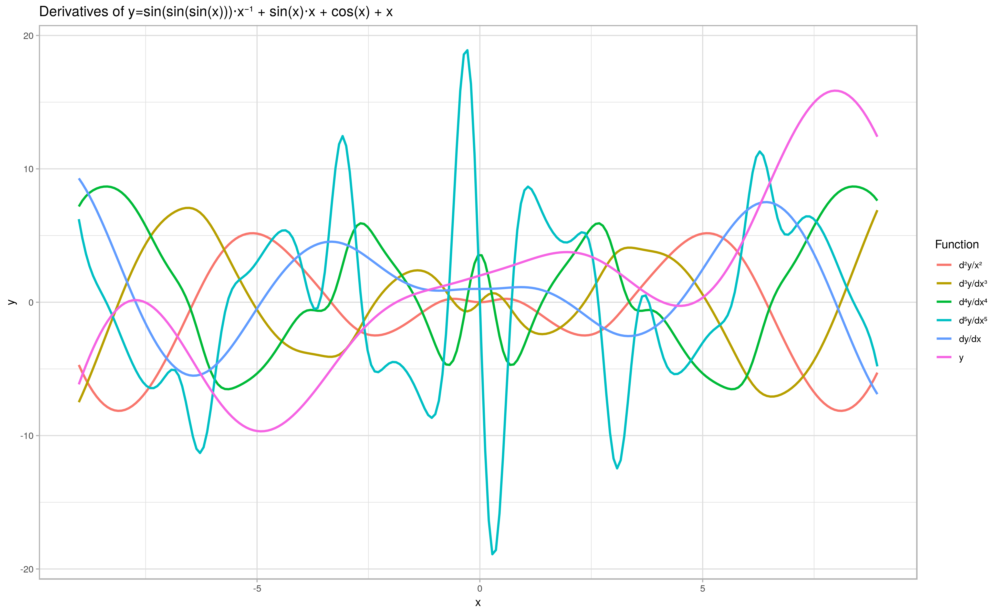

# Kotlin𝛁: A type-safe AD implementation for Kotlin

Kotlin𝛁 is a framework for type safe [automatic differentiation](https://en.wikipedia.org/wiki/Automatic_differentiation) in [Kotlin](https://kotl.in).

# Introduction

Inspired by [Stalin∇](https://github.com/Functional-AutoDiff/STALINGRAD), [Autograd](https://github.com/hips/autograd), [DiffSharp](https://github.com/DiffSharp/DiffSharp), [Tangent](https://github.com/google/tangent), [Myia](https://github.com/mila-udem/myia) et al.

AD is useful for [gradient descent](https://en.wikipedia.org/wiki/Gradient_descent) and has a variety of applications in numerical optimization and machine learning.

We aim to provide an algebraically sound implementation of AD for type safe tensor operations.

# Usage

The following example should help you get started:

```kotlin
import edu.umontreal.kotlingrad.math.calculus.DoubleFunctor
import edu.umontreal.kotlingrad.math.numerical.DoubleReal

@Suppress("NonAsciiCharacters", "LocalVariableName")
fun main(args: Array<String>) {
  with(DoubleFunctor) {
    val x = variable("x")
    val y = variable("y")

    val z = x * (-sin(x * y) + y)      // Operator overloads
    val `∂z_∂x` = d(z) / d(x)          // Leibniz notation
    val `∂z_∂y` = d(z) / d(y)          // Multiple variables
    val `∂²z_∂x²` = d(`∂z_∂x`) / d(x)  // Higher order and
    val `∂²z_∂x∂y` = d(`∂z_∂x`) / d(y) // partial derivatives
    val `∇z` = z.grad()                // Gradient operator

    val values = mapOf(x to DoubleReal(0), y to DoubleReal(1))
    val indVar = z.independentVariables().joinToString(", ")
    val p = "${x(x to DoubleReal(0))}, ${y(y to DoubleReal(1))}"
    
    print("z($indVar) \t\t\t\t= $z\n" +
        "∂z($p)/∂x \t\t= $`∂z_∂x` \n\t\t\t\t\t\t= " + `∂z_∂x`(values) + "\n" +
        "∂z($p)/∂y \t\t= $`∂z_∂y` \n\t\t\t\t\t\t= " + `∂z_∂y`(values) + "\n" +
        "∂²z($p)/∂x² \t\t= $`∂z_∂y` \n\t\t\t\t\t\t= " + `∂²z_∂x²`(values) + "\n" +
        "∂²z($p)/∂x∂y \t\t= $`∂²z_∂x∂y` \n\t\t\t\t\t\t= " + `∂²z_∂x∂y`(values) + "\n" +
        "∇z($p) \t\t\t= $`∇z` \n\t\t\t\t\t\t= [${`∇z`[x]!!(values)}, ${`∇z`[y]!!(values)}]ᵀ")
  }
}
```

Running [this program](src/main/kotlin/edu/umontreal/math/samples/HelloKotlinGrad.kt) via `./gradlew demo` should print:

```
z(x, y) 				= ((y + -sin((y * x))) * x)
∂z(0.0, 1.0)/∂x 		= ((1.0 * (y + -sin((y * x)))) + (x * -((1.0 * y) * cos((y * x))))) 
						= 1.0
∂z(0.0, 1.0)/∂y 		= ((0.0 * (y + -sin((y * x)))) + (x * (-(((0.0 * y) + x) * cos((y * x))) + 1.0))) 
						= 0.0
∂²z(0.0, 1.0)/∂x² 		= ((0.0 * (y + -sin((y * x)))) + (x * (-(((0.0 * y) + x) * cos((y * x))) + 1.0))) 
						= -2.0
∂²z(0.0, 1.0)/∂x∂y 		= ((-((-(((0.0 * y) + x) * sin((y * x))) * (1.0 * y)) + cos((y * x))) * x) + (-(((0.0 * y) + x) * cos((y * x))) + 1.0)) 
						= 1.0
∇z(0.0, 1.0) 			= {x=((1.0 * (y + -sin((y * x)))) + (x * -((1.0 * y) * cos((y * x))))), y=((0.0 * (y + -sin((y * x)))) + (x * (-(((0.0 * y) + x) * cos((y * x))) + 1.0)))} 
						= [1.0, 0.0]ᵀ
```

To run [the tests](src/test/kotlin/edu/umontreal/kotlingrad), execute: `./gradlew test`

### Plotting



This plot was generated with the following code:

```kotlin
import edu.umontreal.kotlingrad.math.calculus.DoubleFunctor
import edu.umontreal.kotlingrad.utils.step
import krangl.dataFrameOf
import kravis.geomLine
import kravis.plot
import java.io.File

@Suppress("NonAsciiCharacters", "LocalVariableName", "RemoveRedundantBackticks")
fun main(args: Array<String>) {
  with(DoubleFunctor) {
    val x = variable()

    val y = sin(x) / x
    val `dy_dx` = d(y) / d(x)
    val `d²y_dx²` = d(dy_dx) / d(x)
    val `d³y_dx³` = d(`d²y_dx²`) / d(x)
    val `d⁴y_dx⁴` = d(`d³y_dx³`) / d(x)

    val xs = -10.0..10.0 step 0.1

    val ys = (xs.map { listOf(it, y(x to it), "y=sin(x)/x") } +
        xs.map { listOf(it, dy_dx(x to it), "dy/dx") } +
        xs.map { listOf(it, `d²y_dx²`(x to it), "d²y/x²") } +
        xs.map { listOf(it, `d³y_dx³`(x to it), "d³y/dx³") } +
        xs.map { listOf(it, `d⁴y_dx⁴`(x to it), "d⁴y/dx⁴") }).flatten()

    dataFrameOf("x", "y", "Function")(ys)
        .plot(x = "x", y = "y", color = "Function")
        .geomLine(size = 1.2)
        .title("Derivatives of y=sin(x)/x")
        .save(File("src/main/resources/plot.png"))
  }
}
```

To generate the above plot, you will need to install R and some packages. Ubuntu 18.04 instructions follow:

```
sudo apt-get install r-base && \
sudo ln -s /usr/bin/R /usr/local/bin/R && \
R -e "install.packages(c('ggplot2','dplyr','readr','forcats'))"
```

Then run `./gradlew plot`.

## Ideal API (WIP)

### Scalar functions

```kotlin
val x = Variable(1.0)              // x: Variable<Double> inferred type
val y = Variable(1.0)              // x: Variable<Double> "
val f = x * y + sin(2 * x + 3 * y) // f: BinaryFunction<Double> "
val g = f(x to -1.0)               // g: UnaryFunction<Double> == -y + sin(-2 + 3 * y)
val h = f(x to 0.0, y to 0.0)      // h: Const<Double> == 0 + sin(0 + 0) == 0
```

### Vector functions

```kotlin
val x = VVariable(0.0, 0.0, 0.0)   // x: VVariable<Double, `3`>
val y = VVariable(0.0, `3`)        // x: VVariable<Double, `3`>
val f = 2 * x + x / 2              // f: UnaryVFunction<Double>
val g = f(-2.0, 0.0, 2.0)          // g: ConstVector<`3`> == [-3. 0. 5.]
```

### Matrix functions

```kotlin
val x = MVariable(0.0, 0.0, 0.0)   // x: MVariable<Double, `1`, `3`>
val y = MVariable(0.0, `3`, `3`)   // y: MVariable<Double, `3`, `3`>
val f = sin(2 * x) + log(x / 2)    // f: UnaryMFunction<Double>
val g = f(x) / d(x)                // g: UnaryMFunction<Double>
```

## References

The following are some excellent projects and publications that have inspired this work.

### Computer Algebra

* [A Design Proposal for an Object Oriented Algebraic Library](https://pdfs.semanticscholar.org/6fd2/88960ef83469c898a3d8ed8f0950e7839625.pdf)
* [On Using Generics for Implementing Algebraic Structures](http://www.cs.ubbcluj.ro/~studia-i/contents/2011-4/02-Niculescu.pdf)
* [How to turn a scripting language into a domain specific language for computer algebra](https://arxiv.org/pdf/0811.1061.pdf)
* [Evaluation of a Java Computer Algebra System](https://pdfs.semanticscholar.org/ce81/39a9008bdc7d23be0ff05ef5a16d512b352c.pdf)
* [jalgebra](https://github.com/mdgeorge4153/jalgebra): An abstract algebra library for Java
* [Typesafe Abstractions for Tensor Operations](https://arxiv.org/pdf/1710.06892.pdf)
* [Generalized Algebraic Data Types and Object-Oriented Programming](https://www.microsoft.com/en-us/research/wp-content/uploads/2016/02/gadtoop.pdf)

### Automatic Differentiation

* [The Simple Essence of Automatic Differentiation](http://conal.net/papers/essence-of-ad/essence-of-ad-icfp.pdf)
* [Reverse-Mode AD in a Functional Framework: Lambda the Ultimate Backpropagator](http://www-bcl.cs.may.ie/~barak/papers/toplas-reverse.pdf)
* [Stalin∇](https://github.com/Functional-AutoDiff/STALINGRAD)
* [Autograd](https://github.com/hips/autograd)
* [DiffSharp](https://github.com/DiffSharp/DiffSharp)
* [Tangent](https://github.com/google/tangent)
* [Myia](https://github.com/mila-udem/myia)
* [First-Class Automatic Differentiation in Swift: A Manifesto](https://gist.github.com/rxwei/30ba75ce092ab3b0dce4bde1fc2c9f1d)


### Differentiable Programming

* [Neural Networks, Types, and Functional Programming](http://colah.github.io/posts/2015-09-NN-Types-FP/)
* [Backpropagation with Continuation Callbacks: Foundations for Efficient and Expressive Differentiable Programming](http://papers.nips.cc/paper/8221-backpropagation-with-callbacks-foundations-for-efficient-and-expressive-differentiable-programming.pdf)
* [Demystifying Differentiable Programming: Shift/Reset the Penultimate Backpropagator](https://www.cs.purdue.edu/homes/rompf/papers/wang-preprint201811.pdf)
* [Operational Calculus for Differentiable Programming](https://arxiv.org/pdf/1610.07690.pdf)
* [Efficient Differentiable Programming in a Functional Array-Processing Language](https://arxiv.org/pdf/1806.02136.pdf)
* [Software 2.0](https://medium.com/@karpathy/software-2-0-a64152b37c35)

### Computational Mathematics

* [KMath](https://github.com/altavir/kmath) - Kotlin mathematics extensions library
* [An introduction to context-oriented programming in Kotlin](https://proandroiddev.com/an-introduction-context-oriented-programming-in-kotlin-2e79d316b0a2)
* [COJAC](https://github.com/Cojac/Cojac) - Numerical sniffing tool and Enriching number wrapper for Java
* [chebfun](http://www.chebfun.org/) - Allows representing functions as [Chebyshev polynomials](https://en.wikipedia.org/wiki/Chebyshev_polynomials), for easy symbolic differentiation (or integration)

### Vector, Matrix and Tensor Calculus

* [The Matrix Calculus You Need For Deep Learning](https://explained.ai/matrix-calculus/index.html)

### Neural Networks

* [Hacker's Guide to Neural Networks](http://karpathy.github.io/neuralnets/)