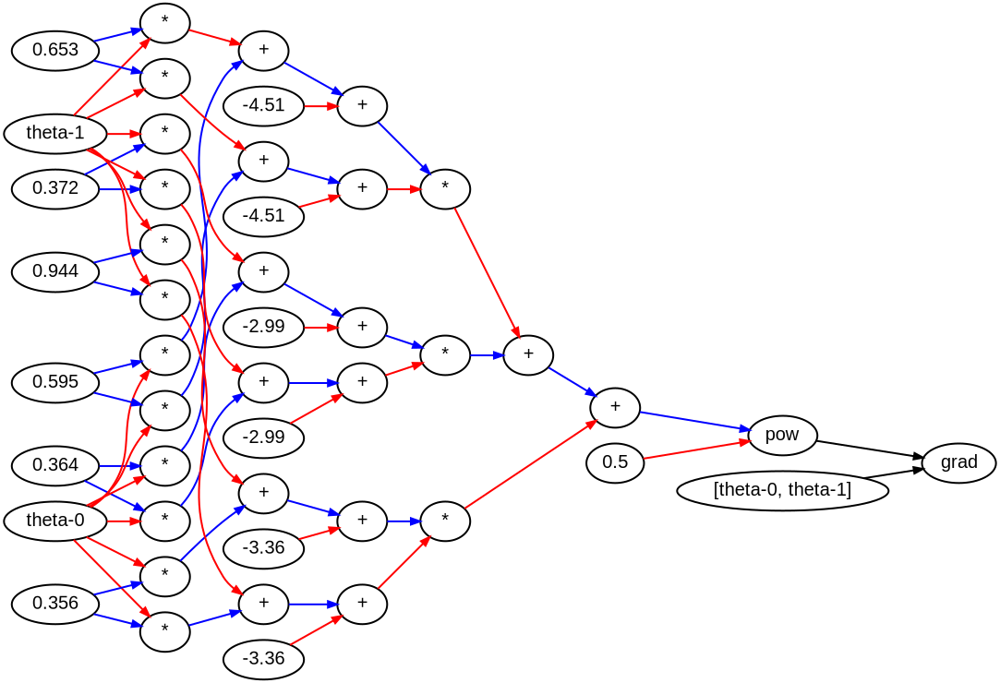
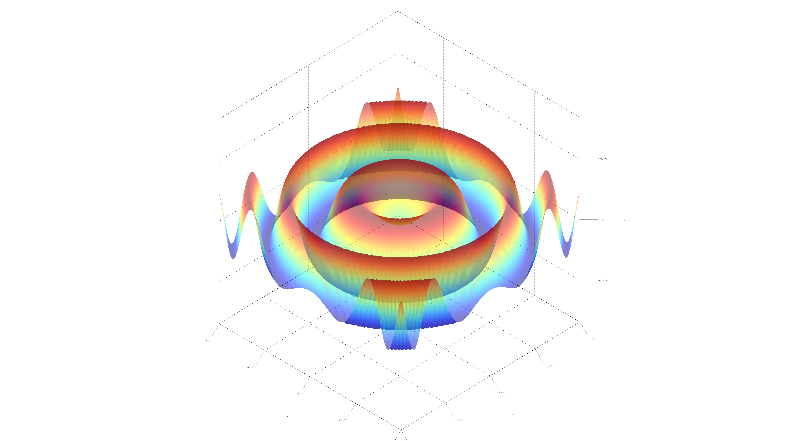
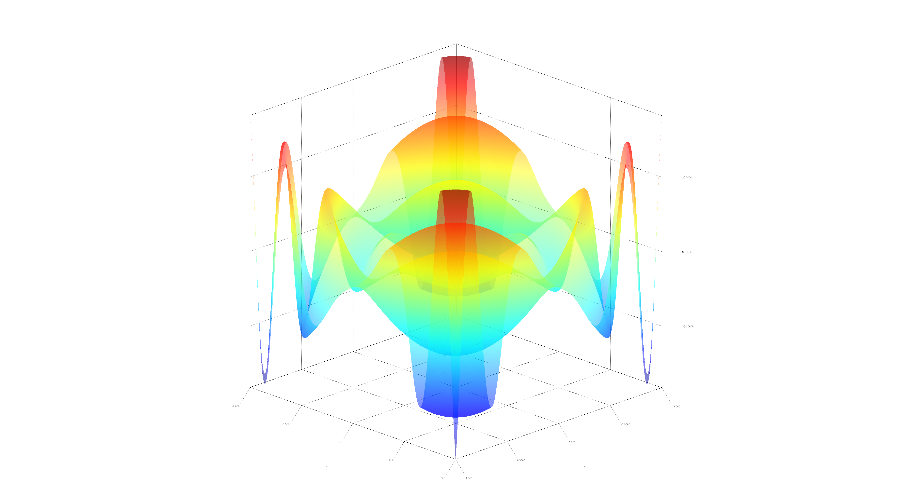
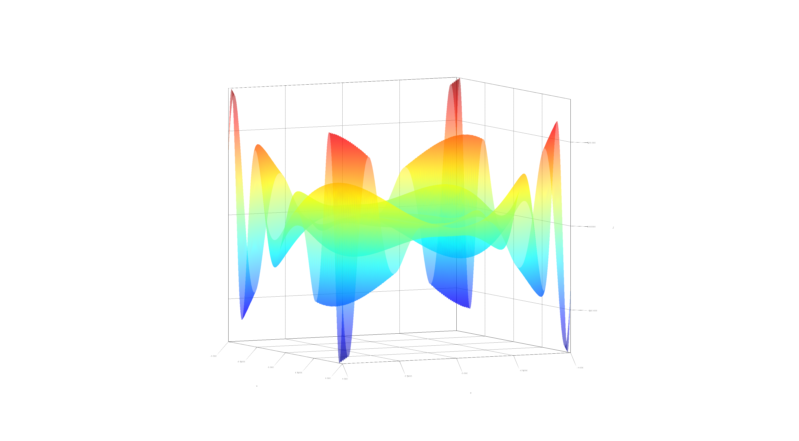
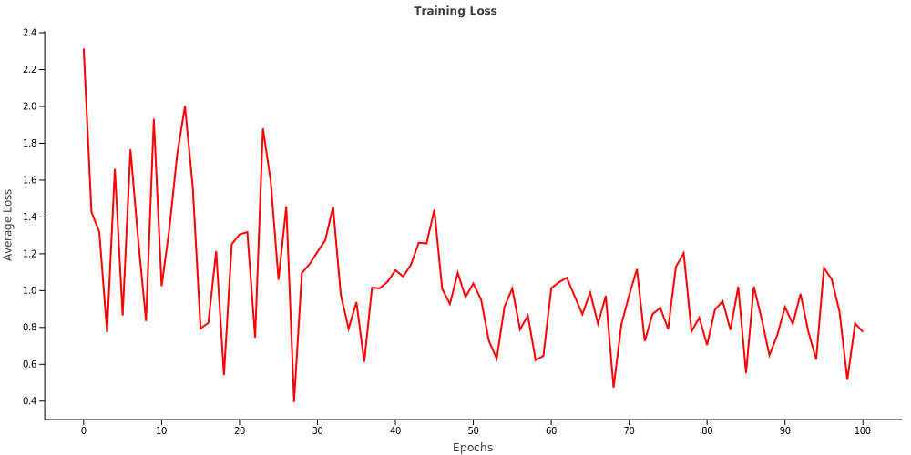
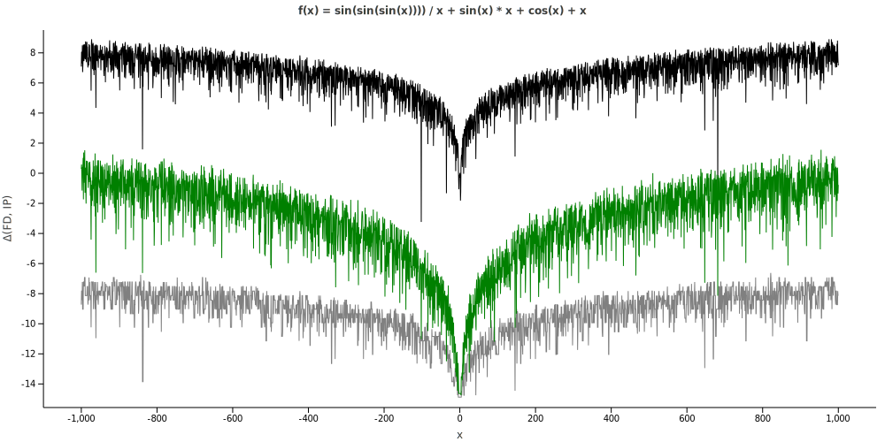
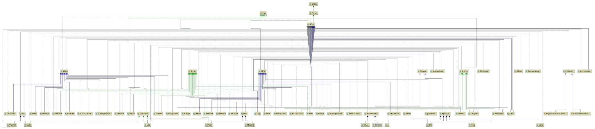

<!--- @file:Suppress("ClassName") --->
<!--- @file:Suppress("PropertyName") --->

# Kotlin∇: Type-safe Symbolic Differentiation for Kotlin

[](http://kotlinlang.org)
[](https://jitpack.io/#breandan/kotlingrad)
[](https://github.com/breandan/kotlingrad/actions)
[](https://doi.org/10.5281/zenodo.3549076)

Kotlin∇ is a type-safe [automatic differentiation](https://en.wikipedia.org/wiki/Automatic_differentiation) framework in [Kotlin](https://kotl.in). It allows users to express differentiable programs with higher-dimensional data structures and operators. We attempt to restrict syntactically valid constructions to those which are algebraically valid and can be checked at compile-time. By enforcing these constraints in the type system, it eliminates certain classes of runtime errors that may occur during the execution of a differentiable program. Due to type-inference in the language, most types may be safely omitted by the end user. Kotlin∇ strives to be expressive, safe, and notationally similar to mathematics. It is currently pre-release and offers no stability guarantees at this time.

## Table of contents

* [Introduction](#introduction)
* [Supported features](#features)
* [Usage](#usage)
  * [Installation](#installation)
  * [Notation](#notation)
  * [Shape safety](#shape-safety)
  * [Higher rank](#higher-rank-derivatives)
  * [Higher order](#higher-order-derivatives)
  * [Example](#example)
* [Visualization](#visualization-tools)
  * [Dataflow graphs](#dataflow-graphs)
  * [Plotting functions](#plotting)
  * [Loss curves](#loss-curves)
* [Testing and gradient checking](#testing)
* [How does it work?](#how)
  * [Operator overloading](#operator-overloading)
  * [First-class functions](#first-class-functions)
  * [Multi-stage programming](#multi-stage-programming)
  * [Extension functions](#extension-functions)
  * [Algebraic data types](#algebraic-data-types)
  * [Multiple dispatch](#multiple-dispatch)
  * [Shape-safe tensor operations](#shape-safe-tensor-operations)
  * [Property Delegation](#property-delegation)
  * [Coroutines](#coroutines)
* [Formal grammar](#grammar)
* [UML diagram](#uml-diagram)
* [Comparison to other frameworks](#comparison)
* [Citation](#citation)
* [References](#references)
* [Acknowledgements](#special-thanks)

## Introduction

Inspired by [Stalin∇](https://github.com/Functional-AutoDiff/STALINGRAD), [Autograd](https://github.com/hips/autograd), [DiffSharp](https://github.com/DiffSharp/DiffSharp), [Myia](https://github.com/mila-udem/myia), [Nexus](https://github.com/ctongfei/nexus), [Tangent](https://github.com/google/tangent), [Lantern](https://github.com/feiwang3311/Lantern) et al., Kotlin∇ attempts to port recent advancements in automatic differentiation (AD) to the Kotlin language. AD is useful for [gradient descent](https://en.wikipedia.org/wiki/Gradient_descent) and has a variety of applications in [numerical optimization](https://uhra.herts.ac.uk/bitstream/handle/2299/4342/903843.pdf) and [machine learning](http://www.jmlr.org/papers/volume18/17-468/17-468.pdf). Our implementation adds a number of experimental ideas, including compile-time [shape-safety](#shape-safety), [algebraic simplification](#multiple-dispatch) and numerical [stability checking](#testing) with property-based testing. We aim to provide an [algebraically-grounded](#operator-overloading) implementation of AD for shape-safe tensor operations. Tensors in Kotlin∇ are represented as [multidimensional arrays](https://en.wikipedia.org/wiki/Tensor#As_multidimensional_arrays).

## Features

Kotlin∇ currently supports the following features:

* Arithmetical operations on scalars, vectors and matrices
* Shape-safe vector and matrix algebra
* Partial and higher-order differentiation on scalars
* Property-based testing for numerical gradient checking
* Recovery of symbolic derivatives from AD

Additionally, it aims to support:

* PyTorch-style [define-by-run](https://openreview.net/pdf?id=BJJsrmfCZ#section.1) semantics
* N-dimensional tensors and [higher-order tensor operators](https://en.wikipedia.org/wiki/Tensor_contraction)
* Fully-general AD over control flow, variable reassignment
(via [delegation](https://kotlinlang.org/docs/reference/delegated-properties.html)), and array programming, possibly using a typed IR such as [Myia](https://github.com/mila-udem/myia)

All of these features are implemented without access to bytecode or special compiler tricks - just using [higher-order functions and lambdas](https://kotlinlang.org/docs/reference/lambdas.html) as shown in [Lambda the Ultimate Backpropogator](http://www-bcl.cs.may.ie/~barak/papers/toplas-reverse.pdf), embedded DSLs a la [Lightweight Modular Staging](https://infoscience.epfl.ch/record/150347/files/gpce63-rompf.pdf), and [ordinary generics](https://kotlinlang.org/docs/reference/generics.html). Please see below for a more detailed [feature comparison](#comparison).

## Usage

### Installation

Kotlin∇ is hosted on [JitPack](https://jitpack.io/#breandan/kotlingrad).

#### Gradle

```kotlin
repositories {
    maven("https://jitpack.io")
}

dependencies {
    implementation("com.github.breandan:kotlingrad:0.2.4")
}
```

#### Maven

```xml
<project>
  <repositories>
    <repository>
      <id>jitpack.io</id>
      <url>https://jitpack.io</url>
    </repository>
  </repositories>
  
  <dependency>
    <groupId>com.github.breandan</groupId>
    <artifactId>kotlingrad</artifactId>
    <version>0.2.4</version>
  </dependency>
</project>
```

#### Jupyter Notebook

[First install](https://github.com/breandan/kotlin-jupyter#installation) the Kotlin Jupyter kernel, then copy the library descriptor into the local settings directory:

```
mkdir -p ~/.jupyter_kotlin/libraries && cp kotlingrad.json ~/.jupyter_kotlin/libraries/
```

Then import Kotlin∇ using the following line magic:

```
%use kotlingrad
```

For more information, explore the [tutorial](samples/notebooks/hello_kotlingrad.ipynb).

### Notation

Kotlin∇ operators are [higher-order functions](https://en.wikipedia.org/wiki/Higher-order_function), which take at most two inputs and return a single output, all of which are functions with the same numerical type, and whose shape is denoted using superscript in the rightmost column below. 

|                 Math                    |      Infix <sup>&dagger;</sup>  |              Prefix              |     Postfix<sup>&Dagger;</sup>      |                                            Operator Type Signature                                               |
|:---------------------------------------:|:-------------------------------:|:--------------------------------:|:-----------------------------------:|:----------------------------------------------------------------------------------------------------------------:|
|      ![][compose]<br>![][circ-compose]  |       `a(b)`<br>`a of b`        |                                  |                                     |       (`a`:  ℝ<sup>τ</sup>→ℝ<sup>π</sup>, `b`: ℝ<sup>λ</sup> → ℝ<sup>τ</sup>) → (ℝ<sup>λ</sup>→ℝ<sup>π</sup>)    |
|              ![][plus-minus]            |       `a + b`<br>`a - b`        | `plus(a, b)`<br>`minus(a, b)`    |                                     |       (`a`:  ℝ<sup>τ</sup>→ℝ<sup>π</sup>, `b`: ℝ<sup>λ</sup> → ℝ<sup>π</sup>) → (ℝ<sup>?</sup>→ℝ<sup>π</sup>)    |
|              ![][mul]                   |     `a * b`<br>`a.times(b)`     |          `times(a, b)`           |                                     |      (`a`: ℝ<sup>τ</sup>→ℝ<sup>m×n</sup>, `b`: ℝ<sup>λ</sup>→ℝ<sup>n×p</sup>) → (ℝ<sup>?</sup>→ℝ<sup>m×p</sup>)  |
|          ![][div]<br>![][inv]           |      `a / b`<br>`a.div(b)`      |           `div(a, b)`            |                                     |      (`a`: ℝ<sup>τ</sup>→ℝ<sup>m×n</sup>, `b`: ℝ<sup>λ</sup>→ℝ<sup>p×n</sup>) → (ℝ<sup>?</sup>→ℝ<sup>m×p</sup>)  |
|              ![][pos-neg]               |                                 |           `-a`<br>`+a`           | `a.unaryMinus()`<br>`a.unaryPlus()` |                           (`a`: ℝ<sup>τ</sup>→ℝ<sup>π</sup>) → (ℝ<sup>τ</sup>→ℝ<sup>π</sup>)                     |
|  ![][sin]<br>![][cos]<br>![][tan]       |                                 | `sin(a)`<br>`cos(a)`<br>`tan(a)` | `a.sin()`<br>`a.cos()`<br>`a.tan()` |                                               (`a`: ℝ→ℝ) → (ℝ→ℝ)                                                 |
|              ![][ln]                    |                                 |       `ln(a)`<br>`log(a)`        |        `a.ln()`<br>`a.log()`        |                         (`a`: ℝ<sup>τ</sup>→ℝ<sup>m×m</sup>) → (ℝ<sup>τ</sup>→ℝ<sup>m×m</sup>)                   |
|              ![][log]                   |           `a.log(b)`            |           `log(a, b)`            |                                     |              (`a`: ℝ<sup>τ</sup>→ℝ<sup>m×m</sup>, `b`: ℝ<sup>λ</sup>→ℝ<sup>m×m</sup>) → (ℝ<sup>?</sup>→ℝ)        |
|              ![][power]                 |           `a.pow(b)`            |           `pow(a, b)`            |                                     |              (`a`: ℝ<sup>τ</sup>→ℝ<sup>m×m</sup>, `b`: ℝ<sup>λ</sup>→ℝ) → (ℝ<sup>?</sup>→ℝ<sup>m×m</sup>)        |
|        ![][sqrt]<br>![][cbrt]           |  `a.pow(1.0/2)`<br>`a.root(3)`  |      `sqrt(a)`<br>`cbrt(a)`      |      `a.sqrt()`<br>`a.cbrt()`       |                               (`a`: ℝ<sup>τ</sup>→ℝ<sup>m×m</sup>) → (ℝ<sup>τ</sup>→ℝ<sup>m×m</sup>)             |
|     ![][leibniz]<br>![][euler]          |  `a.d(b)`<br>`d(a) / d(b)`      |            `grad(a)[b]`          |                                     |                           (`a`: C(ℝ<sup>τ</sup>→ℝ)<sup>*</sup>, `b`: C(ℝ<sup>λ</sup>→ℝ)) → (ℝ<sup>?</sup>→ℝ)     |
|              ![][gradient]              |                                 |            `grad(a)`             |             `a.grad()`              |                           (`a`: C(ℝ<sup>τ</sup>→ℝ)) → (ℝ<sup>τ</sup>→ℝ<sup>τ</sup>)                              |
|              ![][gradient_wrt]          |     `a.d(b)`<br>`a.grad(b)`     |   `grad(a, b)`<br>`grad(a)[b]`   |                                     |   (`a`: C(ℝ<sup>τ</sup>→ℝ<sup>π</sup>), `b`: C(ℝ<sup>λ</sup>→ℝ<sup>ω</sup>)) → (ℝ<sup>?</sup>→ℝ<sup>π×ω</sup>)   |
|              ![][divg]                  |                                 |            `divg(a)`             |             `a.divg()`              |                     (`a`: C(ℝ<sup>τ</sup>→ℝ<sup>m</sup>)) → (ℝ<sup>τ</sup>→ℝ)                                    |
|              ![][curl]                  |                                 |            `curl(a)`             |             `a.curl()`              |                     (`a`: C(ℝ<sup>3</sup>→ℝ<sup>3</sup>)) → (ℝ<sup>3</sup>→ℝ<sup>3</sup>)                        |
|              ![][jacobian]              |                                 |            `grad(a)`             |             `a.grad()`              |               (`a`: C(ℝ<sup>τ</sup>→ℝ<sup>m</sup>)) → (ℝ<sup>τ</sup>→ℝ<sup>m×τ</sup>)                            |
|              ![][hessian]               |                                 |            `hess(a)`             |             `a.hess()`              |                           (`a`: C(ℝ<sup>τ</sup>→ℝ)) → (ℝ<sup>τ</sup>→ℝ<sup>τ×τ</sup>)                            |
|              ![][laplacian]             |                                 |            `lapl(a)`             |             `a.lapl()`              |                           (`a`: C(ℝ<sup>τ</sup>→ℝ)) → (ℝ<sup>τ</sup>→ℝ<sup>τ</sup>)                              |

<!-- Equations -->

[compose]:      https://render.githubusercontent.com/render/math?math=\mathbf{A}(\mathbf{B})
[circ-compose]: https://render.githubusercontent.com/render/math?math=\mathbf{A}\circ\mathbf{B}
[plus-minus]:   https://render.githubusercontent.com/render/math?math=\mathbf{A}\pm\mathbf{B}
[mul]:          https://render.githubusercontent.com/render/math?math=\mathbf{A}\mathbf{B}
[pos-neg]:      https://render.githubusercontent.com/render/math?math=\pm\mathbf{A}
[div]:          https://render.githubusercontent.com/render/math?math=\frac{\mathbf{A}}{\mathbf{B}}
[inv]:          https://render.githubusercontent.com/render/math?math=\mathbf{A}\mathbf{B}^{-1}
[sin]:          https://render.githubusercontent.com/render/math?math=\sin{a}
[cos]:          https://render.githubusercontent.com/render/math?math=\cos{a}
[tan]:          https://render.githubusercontent.com/render/math?math=\tan{a}
[ln]:           https://render.githubusercontent.com/render/math?math=\ln{a}
[log]:          https://render.githubusercontent.com/render/math?math=\log_{b}a
[power]:        https://render.githubusercontent.com/render/math?math=\mathbf{A}^b
[sqrt]:         https://render.githubusercontent.com/render/math?math=\sqrt{A}
[cbrt]:         https://render.githubusercontent.com/render/math?math=\sqrt[3]{A}
[leibniz]:      https://render.githubusercontent.com/render/math?math=\frac{da}{db},\frac{\partial{a}}{\partial{b}}
[euler]:        https://render.githubusercontent.com/render/math?math=D_b{a}
[gradient]:     https://render.githubusercontent.com/render/math?math=\nabla{a}
[gradient_wrt]: https://render.githubusercontent.com/render/math?math=\nabla_{\mathbf{B}}a
[divg]:         https://render.githubusercontent.com/render/math?math=\nabla\cdot{\mathbf{A}}
[curl]:         https://render.githubusercontent.com/render/math?math=\nabla\times{\mathbf{A}}
[jacobian]:     https://render.githubusercontent.com/render/math?math=\mathcal{J}(\mathbf{A})
[hessian]:      https://render.githubusercontent.com/render/math?math=\mathbf{H}(a)
[laplacian]:    https://render.githubusercontent.com/render/math?math=\Delta{a},\nabla^{2}a

ℝ can be a `Double`, `Float` or `BigDecimal`. Specialized operators are defined for subsets of ℝ, e.g. `Int`, `Short` or `BigInteger` for subsets of ℤ, however differentiation is [only defined](https://en.wikipedia.org/wiki/Differentiable_function) for continuous functions on ℝ.

<sup>&dagger;</sup> `a` and `b` are higher-order functions. These may be constants (e.g. `0`, `1.0`), variables (e.g. `Var()`) or expressions (e.g. `x + 1`, `2 * x + y`).

<sup>&Dagger;</sup> For infix notation, `.` is optional. Parentheses are also optional depending on [precedence](https://kotlinlang.org/docs/reference/functions.html#infix-notation).

<sup>&sect;</sup> Matrix division is defined iff **B** is invertible, although it could be possible to redefine this operator using the [Moore-Penrose inverse](https://en.wikipedia.org/wiki/Moore%E2%80%93Penrose_inverse).

<sup>&lowast;</sup> Where C(ℝ<sup>m</sup>) is the space of all continuous functions over ℝ. If the function is not over ℝ, it will fail at compile-time. If the function is over ℝ but not continuous differentiable at the point under consideration, it will fail at runtime.

<sup>?</sup> The input shape is tracked at runtime, but not at the type level. While it would be nice to infer a union type bound over the inputs of binary functions, it is likely impossible using the Kotlin type system [without great effort](core/src/main/kotlin/edu/umontreal/kotlingrad/experimental/VariableCapture.kt). If the user desires type checking when invoking higher order functions with literal values, they will need to specify the combined input type explicitly, or do so at runtime.

<sup>τ, λ, π, ω</sup> Arbitrary products.

### Higher Rank Derivatives

Kotlin∇ supports derivatives between tensors of up to rank 2. The shape of a tensor derivative depends on (1) the shape of the function under differentiation and (2) the shape of the variable with respect to which we are differentiating.

|              I/O Shape               |        ℝ<sup>?</sup>→ℝ        |  ℝ<sup>?</sup>→ℝ<sup>m</sup>  | ℝ<sup>?</sup>→ℝ<sup>j×k</sup> |
|:------------------------------------:|:-----------------------------:|:-----------------------------:|:-----------------------------:|
|        <b>ℝ<sup>?</sup>→ℝ</b>        |        ℝ<sup>?</sup>→ℝ        |  ℝ<sup>?</sup>→ℝ<sup>m</sup>  | ℝ<sup>?</sup>→ℝ<sup>j×k</sup> |
|  <b>ℝ<sup>?</sup>→ℝ<sup>n</sup></b>  |  ℝ<sup>?</sup>→ℝ<sup>n</sup>  | ℝ<sup>?</sup>→ℝ<sup>m×n</sup> |              :x:              |
| <b>ℝ<sup>?</sup>→ℝ<sup>h×i</sup></b> | ℝ<sup>?</sup>→ℝ<sup>h×i</sup> |              :x:              |              :x:              |

Matrix-by-vector, vector-by-matrix, and matrix-by-matrix derivatives require rank 3+ tensors and are currently unsupported.

### Higher Order Derivatives

Kotlin∇ supports arbitrary order derivatives on scalar functions, and up to 2nd order derivatives on vector functions. Higher order derivatives on matrix functions are unsupported.

### Shape Safety

Shape safety is an important concept in Kotlin∇. There are three broad strategies for handling shape errors:

* Hide the error somehow by implicitly reshaping or [broadcasting](https://docs.scipy.org/doc/numpy-1.10.4/user/basics.broadcasting.html) arrays
* Announce the error at runtime, with a relevant message, e.g. [`InvalidArgumentError`](https://www.tensorflow.org/api_docs/python/tf/errors/InvalidArgumentError)
* Do not allow programs which can result in a shape error to compile

In Kotlin∇, we use the last strategy to check the shape of tensor operations. Consider the following program:

```kotlin
// Inferred type: Vec<Double, D2>
val a = Vec(1.0, 2.0)
// Inferred type: Vec<Double, D3>
val b = Vec(1.0, 2.0, 3.0)

val c = b + b

// Does not compile, shape mismatch
// a + b
```

Attempting to sum two vectors whose shapes do not match will fail to compile, and they must be explicitly resized.

```kotlin
// Inferred type: Mat<Double, D1, D4>
val a = Mat1x4(1.0, 2.0, 3.0, 4.0)
// Inferred type: Mat<Double, D4, D1>
val b = Mat4x1(1.0, 2.0, 3.0, 4.0)

val c = a * b

// Does not compile, inner dimension mismatch
// a * a
// b * b
```

Similarly, attempting to multiply two matrices whose inner dimensions do not match will fail to compile.

```kotlin
val a = Mat2x4( 
  1.0, 2.0, 3.0, 4.0,
  5.0, 6.0, 7.0, 8.0
)

val b = Mat4x2( 
  1.0, 2.0,
  3.0, 4.0,
  5.0, 6.0,
  7.0, 8.0
)

// Types are optional, but encouraged
val c: Mat<Double, D2, D2> = a * b 

val d = Mat2x1(1.0, 2.0)

val e = c * d

val f = Mat3x1(1.0, 2.0, 3.0)

// Does not compile, inner dimension mismatch
// e * f
```

Explicit types are optional but encouraged. [Type inference](https://www.youtube.com/watch?v=MyljSWm0Y_k) helps preserve shape information over long programs.

```kotlin
fun someMatFun(m: Mat<Double, D3, D1>): Mat<Double, D3, D3> = ...
fun someMatFun(m: Mat<Double, D2, D2>) = ...
```

When writing a function, it is mandatory to declare the input type(s), but the return type [may be omitted](https://kotlinlang.org/docs/reference/functions.html#explicit-return-types). Shape-safety is currently supported up to rank-2 tensors, i.e. matrices.

### Variable Capture

Kotlin∇ provides a DSL with support for type-safe variable capture with variadic currying. Consider the following example:

```kotlin
val q = X + Y * Z + Y + 0.0
val p0 = q(X to 1.0, Y to 2.0, Z to 3.0) // Name resolution
val p1 = q(X to 1.0, Y to 1.0)(Z to 1.0) // Variadic currying
val p3 = q(Z to 1.0)(X to 1.0, Y to 1.0) // Any order is possible
val p4 = q(Z to 1.0)(X to 1.0)(Y to 1.0) // Proper currying
val p5 = q(Z to 1.0)(X to 1.0) // Returns a partially applied function
val p6 = (X + Z + 0)(Y to 1.0) // Does not compile
```

For further details, please refer to [the implementation](core/src/main/kotlin/edu/umontreal/kotlingrad/experimental/VariableCapture.kt).

### Example

The following example shows how to derive higher-order partials of a function `z` of type ℝ²→ℝ:

```kotlin
val z = x * (-sin(x * y) + y) * 4  // Infix notation
val `∂z∕∂x` = d(z) / d(x)          // Leibniz notation [Christianson, 2012]
val `∂z∕∂y` = d(z) / d(y)          // Partial derivatives
val `∂²z∕∂x²` = d(`∂z∕∂x`) / d(x)  // Higher order derivatives
val `∂²z∕∂x∂y` = d(`∂z∕∂x`) / d(y) // Higher order partials
val `∇z` = z.grad()                // Gradient operator

val values = arrayOf(x to 0, y to 1)

println("z(x, y) \t= $z\n" +
  "z(${values.map { it.second }.joinToString(",")}) \t\t= ${z(*values)}\n" +
  "∂z/∂x \t\t= $`∂z∕∂x` \n\t\t= " + `∂z∕∂x`(*values) + "\n" +
  "∂z/∂y \t\t= $`∂z∕∂y` \n\t\t= " + `∂z∕∂y`(*values) + "\n" +
  "∂²z/∂x² \t= $`∂z∕∂y` \n\t\t= " + `∂²z∕∂x²`(*values) + "\n" +
  "∂²z/∂x∂y \t= $`∂²z∕∂x∂y` \n\t\t= " + `∂²z∕∂x∂y`(*values) + "\n" +
  "∇z \t\t= $`∇z` \n\t\t= [${`∇z`[x]!!(*values)}, ${`∇z`[y]!!(*values)}]ᵀ")
```

Any backticks and unicode characters above are simply for readability and have no effect on the behavior. Running [this program](samples/src/main/kotlin/edu/umontreal/kotlingrad/samples/HelloKotlingrad.kt) via `./gradlew HelloKotlingrad` should produce the following output:

```
z(x, y)         = ((x) * ((- (sin((x) * (y)))) + (y))) * (4.0)
z(0, 1)         = 0.0
∂z/∂x           = d(((x) * ((- (sin((x) * (y)))) + (y))) * (4.0)) / d(x) 
                = 4.0
∂z/∂y           = d(((x) * ((- (sin((x) * (y)))) + (y))) * (4.0)) / d(y) 
                = 0.0
∂²z/∂x²         = d(((x) * ((- (sin((x) * (y)))) + (y))) * (4.0)) / d(y) 
                = 4.0
∂²z/∂x∂y        = d(d(((x) * ((- (sin((x) * (y)))) + (y))) * (4.0)) / d(x)) / d(y) 
                = 4.0
∇z              = {y=d(((x) * ((- (sin((x) * (y)))) + (y))) * (4.0)) / d(y), x=d(((x) * ((- (sin((x) * (y)))) + (y))) * (4.0)) / d(x)} 
                = [4.0, 0.0]ᵀ
```

## Visualization tools

Kotlin∇ provides various graphical tools that can be used for visual debugging.

### Dataflow graphs

Kotlin∇ functions are a type of [directed acyclic graph](https://en.wikipedia.org/wiki/Directed_acyclic_graph), called dataflow graphs (DFGs). For example, running the expression `((1 + x * 2 - 3 + y + z / y).d(y).d(x) + z / y * 3 - 2).render()` will display the following DFG:


Red and blue edges indicate the right and left inputs to a binary operator, respectively. Consider the DFG for a batch of stochastic gradients on [linear regression](samples/src/main/kotlin/edu/umontreal/kotlingrad/samples/LinearRegression.kt), which can be written in matrix form as :



Thetas represent the hidden parameters under differentiation and the constants are the batch inputs (**X**) and targets (**Y**). When all the free variables are bound to numerical values, the graph collapses into a single node, which can be unwrapped into a Kotlin `Number`.

### Plotting

To generate the [sample 2D plots](samples/src/main/kotlin/edu/umontreal/kotlingrad/samples/Plot2D.kt) below, run `./gradlew Plot2D`.

<p align="center"></p>
<p align="center"></p>

Plotting is also possible in higher dimensions, [for example](samples/src/main/kotlin/edu/umontreal/kotlingrad/samples/Plot3D.kt) in 3D via `./gradlew Plot3D`:






### Loss curves

Gradient descent is one application for Kotlin∇. Below, is a typical loss curve of SGD on [a multilayer perceptron](samples/src/main/kotlin/edu/umontreal/kotlingrad/samples/MLP.kt):



To train the model, execute `./gradlew MLP` from within the parent directory.

## Testing

To run [the tests](core/src/test/kotlin/edu/umontreal/kotlingrad), execute: `./gradlew test`

Kotlin∇ claims to eliminate certain runtime errors, but how do we know the proposed implementation is not incorrect? One method, borrowed from the Haskell community, is called property-based testing (PBT), closely related to [metamorphic testing](https://en.wikipedia.org/wiki/Metamorphic_testing). Notable implementations include [QuickCheck](https://github.com/nick8325/quickcheck), [Hypothesis](https://github.com/HypothesisWorks/hypothesis) and [ScalaTest](http://www.scalatest.org/user_guide/property_based_testing) (ported to Kotlin in [KotlinTest](https://github.com/kotlintest/kotlintest)). PBT uses algebraic properties to verify the result of an operation by constructing semantically equivalent but syntactically distinct expressions, which should produce the same answer. Kotlin∇ uses two such equivalences to validate its AD implementation:

* [Analytic differentiation](https://en.wikipedia.org/wiki/Differentiation_rules): manually differentiate and compare the values returned on a subset of the domain with AD.
* [Finite difference approximation](https://en.wikipedia.org/wiki/Finite_difference_method): sample space of symbolic (differentiable) functions, comparing results of AD to FD.

For example, consider the following test, which checks whether the analytical derivative and the automatic derivative, when evaluated at a given point, are equal to each other within the limits of numerical precision:

```kotlin
val x by Var()
val y by Var()

val z = y * (sin(x * y) - x)            // Function under test
val `∂z∕∂x` = d(z) / d(x)               // Automatic derivative
val manualDx = y * (cos(x * y) * y - 1) // Analytical derivative 

"∂z/∂x should be y * (cos(x * y) * y - 1)" {
  NumericalGenerator.assertAll { ẋ, ẏ ->
    // Evaluate the results at a given seed
    val autoEval = `∂z∕∂x`(x to ẋ, y to ẏ) 
    val manualEval = manualDx(x to ẋ, y to ẏ)
    // Should pass iff Δ(adEval, manualEval) < Ɛ
    autoEval shouldBeApproximately manualEval
  }
}
```

PBT will search the input space for two numerical values `ẋ` and `ẏ`, which violate the specification, then ["shrink"](https://hackage.haskell.org/package/QuickCheck-2.12.6.1/docs/Test-QuickCheck-Arbitrary.html#v:shrink) them to discover pass-fail boundary values. We can construct a similar test using finite differences:

```kotlin
"d(sin x)/dx should be equal to (sin(x + dx) - sin(x)) / dx" {
  NumericalGenerator.assertAll { ẋ ->
    val f = sin(x)
    
    val `df∕dx` = d(f) / d(x)
    val adEval = `df∕dx`(ẋ) 
    
    val dx = 1E-8
    // Since ẋ is a raw numeric type, sin => kotlin.math.sin
    val fdEval = (sin(ẋ + dx) - sin(ẋ)) / dx
    adEval shouldBeApproximately fdEval
  }
}
```



Above, we [compare numerical errors](samples/src/main/kotlin/edu/umontreal/kotlingrad/samples/ADSDComparison.kt) for three types of computational differentiation: (1) finite precision automatic differentiation (AD), (2) finite precision symbolic differentiation (SD) and (3) finite precision finite differences (FD) against infinite precision symbolic differentiation (IP). AD and SD both exhibit relative errors (i.e. with respect to each other) several orders of magnitude lower than their absolute errors (i.e. with respect to IP), which roughly agree to within numerical precision. As expected, FD exhibits numerical error significantly higher than AD and SD due to the inaccuracy of floating point division.

There are many other ways to independently verify the numerical gradient, such as [dual numbers](https://en.wikipedia.org/wiki/Dual_number#Differentiation) or the [complex step derivative](https://timvieira.github.io/blog/post/2014/08/07/complex-step-derivative/). Another method is to compare the numerical output against a well-known implementation, such as [TensorFlow](https://github.com/JetBrains/kotlin-native/tree/master/samples/tensorflow). We plan to conduct a more thorough comparison of numerical accuracy and performance.

## How?

To understand the core of Kotlin∇'s AD implementation, please refer to the [scalar example](core/src/main/kotlin/edu/umontreal/kotlingrad/experimental/Scalar.kt).

This project relies on a few Kotlin-native language features, which together enable a concise, flexible and type-safe user interface. The following features have proven beneficial to the development of Kotlin∇:

#### Operator overloading
 
[Operator overloading](https://kotlinlang.org/docs/reference/operator-overloading.html) enables concise notation for arithmetic on abstract types, where the types encode [algebraic structures](https://en.wikipedia.org/wiki/Algebraic_structure), e.g. [`Group`](core/src/main/kotlin/edu/umontreal/kotlingrad/algebra/Group.kt), [`Ring`](core/src/main/kotlin/edu/umontreal/kotlingrad/algebra/Ring.kt), and [`Field`](core/src/main/kotlin/edu/umontreal/kotlingrad/algebra/Field.kt). These abstractions are extensible to other kinds of mathematical structures, such as complex numbers and quaternions.

For example, suppose we have an interface `Group`, which overloads the operators `+` and `*`, and is defined like so:

```kotlin
interface Group<T: Group<T>> {
  operator fun plus(addend: T): T

  operator fun times(multiplicand: T): T
}
```

Here, we specify a recursive type bound using a method known as [F-bounded quantification](http://staff.ustc.edu.cn/~xyfeng/teaching/FOPL/lectureNotes/CookFBound89.pdf) to ensure that operations return the concrete type variable `T`, rather than something more abstract like `Group`. Imagine a class `Fun` which has implemented `Group`. It can be used as follows:

```kotlin
fun <T: Group<T>> cubed(t: T): T = t * t * t

fun <E: Fun<E>> twiceFunCubed(e: E): E = cubed(e) + cubed(e)
```

Like [Python](https://docs.python.org/3.4/library/operator.html), Kotlin supports overloading a [limited set of operators](https://kotlinlang.org/docs/reference/operator-overloading.html), which are evaluated using a [fixed precedence](https://kotlinlang.org/docs/reference/grammar.html#precedence). In the current version of Kotlin∇, operators do not perform any computation, they simply construct a directed acyclic graph representing the symbolic expression. Expressions are only evaluated when invoked as a function.

#### First-class functions

With [higher-order functions and lambdas](https://kotlinlang.org/docs/reference/lambdas.html), Kotlin treats [functions as first-class citizens](https://en.wikipedia.org/wiki/First-class_function). This allows us to represent mathematical functions and programming functions with the same underlying abstractions (typed FP). A number of [recent](http://www-bcl.cs.may.ie/~barak/papers/toplas-reverse.pdf) [papers](https://papers.nips.cc/paper/8221-backpropagation-with-callbacks-foundations-for-efficient-and-expressive-differentiable-programming.pdf) have demonstrated the expressiveness of this paradigm for automatic differentiation.

In Kotlin∇, all expressions can be treated as functions. For example:

```kotlin
fun <T: Group<T>> makePoly(x: Var<T>, y: Var<T>) = x * y + y * y + x * x
val x by Var()
val y by Var()
val f = makePoly(x, y)
val z = f(1.0, 2.0) // Returns a value
println(z) // Prints: 7
```

Additionally, it is possible to build functions consisting of varying dimensional inputs:

```kotlin
fun <T: Fun<T>> mlp(p1: VFun<T, D3>, p2: MFun<T, D3, D3>, p3: T) =
  ((p1 * p2 + p1 * p2 * p2 dot p1 + p1) - p3) pow p3
```

#### Multi-stage programming

Kotlin∇ uses [operator overloading](#operator-overloading) in the host language to first construct a [dataflow graph](#dataflow-graphs), but evaluates the graph lazily. Called "multi-stage programming", or *staging*, this is a metaprogramming technique from the [ML community](http://ocamllabs.io/iocamljs/staging.html) which enables type-safe runtime code translation and compilation. More recently, staging has been put to effective use for [compiling embedded DSLs](https://static.csg.ci.i.u-tokyo.ac.jp/papers/14/scherr-ecoop2014.pdf) similar to Kotlin∇.

In its current form, Kotlin∇ takes a "shallow embedding" approach. Similar to an [interpreter](https://en.wikipedia.org/wiki/Interpreter_pattern), it adheres closely to the user-defined program and does not perform much code specialization or rewriting for optimization purposes. Unlike an interpreter, it postpones evaluation until all free variables in an expression have been bound. Consider the following snippet, which decides when to evaluate an expression:

```kotlin
var EAGER = false
operator fun invoke(newBindings: Bindings<X>): Fun<X> =
    Composition(this, newBindings).run { if (bindings.complete || EAGER) evaluate() else this }
```

If `bindings` are `complete`, this means there are no unbound variables remaining (implementation omitted for brevity), and we can evaluate the expression to obtain a numerical result. Suppose we have the following user code:

```kotlin
val x = Var()
val y = Var()
val z = Var()
val f0 = x + y * z
var f1 = f0(x to 1).also { println(it) } // Prints: (x + y * z)(x=1)
var f2 = f1(y to 2).also { println(it) } // Prints: (x + y * z)(x=1)(y=2)
var f3 = f2(z to 3).also { println(it) } // Prints: 7
```

Once the last line is reached, all variables are bound, and instead of returning a `Composition`, Kotlin∇ evaluates the function, returning a constant. Alternatively, if `EAGER` mode is enabled, each invocation is applied as early as possible:

```kotlin
EAGER = true
f1 = f0(x to 1).also { println(it) } // Prints: 1 + y * z
f2 = f1(y to 2).also { println(it) } // Prints: 1 + 2 * z
f3 = f2(z to 3).also { println(it) } // Prints: 7
```

In the following section, we describe how evaluation works.

#### Algebraic data types

[Algebraic data types](https://en.wikipedia.org/wiki/Algebraic_data_type) (ADTs) in the form of [sealed classes](https://kotlinlang.org/docs/reference/sealed-classes.html) (a.k.a. sum types) facilitate a limited form of pattern matching over a closed set of subclasses. When matching against subclasses of a sealed class, the compiler forces the author to provide an exhaustive control flow over all concrete subtypes of an abstract class. Consider the following classes:

```kotlin
class Const<T: Fun<T>>(val number: Number) : Fun<T>()
class Sum<T: Fun<T>>(val left: Fun<T>, val right: Fun<T>) : Fun<T>()
class Prod<T: Fun<T>>(val left: Fun<T>, val right: Fun<T>) : Fun<T>()
class Var<T: Fun<T>>: Fun<T>() { override val variables: Set<Var<X>> = setOf(this) }
class Zero<T: Fun<T>>: Const<T>(0.0)
class One<T: Fun<T>>: Const<T>(1.0)
```

When branching on the type of a sealed class, consumers must explicitly handle every case, since incomplete control flow will not compile rather than fail silently at runtime. Let us now consider a simplified definition of `Fun`, a sealed class which defines the behavior of function invocation and differentiation, using a restricted form of pattern matching. It can be constructed with a set of `Var`s, and can be invoked with a numerical value:

```kotlin
sealed class Fun<X: Fun<X>>(open val variables: Set<Var<X>> = emptySet()): Group<Fun<X>> {
    constructor(vararg fns: Fun<X>): this(fns.flatMap { it.variables }.toSet())

    // Since the subclasses of Fun are a closed set, no `else  ...` is required.
    operator fun invoke(map: Bindings<X>): Fun<X> = when (this) {
        is Const -> this
        is Var -> map.getOrElse(this) { this } // Partial application is permitted
        is Prod -> left(map) * right(map) // Smart casting implicitly casts after checking
        is Sum -> left(map) + right(map)
    }

    fun d(variable: Var<X>): Fun<X> = when(this) {
       is Const -> Zero
       is Var -> if (variable == this) One else Zero
       // Product rule: d(u*v)/dx = du/dx * v + u * dv/dx
       is Prod -> left.d(variable) * right + left * right.d(variable)
       is Sum -> left.d(variable) + right.d(variable)
    }

    operator fun plus(addend: Fun<T>) = Sum(this, addend)

    operator fun times(multiplicand: Fun<T>) = Prod(this, multiplicand)
}
```

This structure is known as the [interpreter pattern](https://en.wikipedia.org/wiki/Interpreter_pattern).

Kotlin's [smart casting](https://kotlinlang.org/docs/reference/typecasts.html#smart-casts) is an example of [flow-sensitive type analysis](https://en.wikipedia.org/wiki/Flow-sensitive_typing) where the abstract type `Fun` can be treated as `Sum` after performing an `is Sum` check. Without smart casting, we would need to write `(this as Sum).left` to access the member, `left`, causing a potential `ClassCastException` if the cast were mistaken.

#### Extension Functions

[Extension functions](https://kotlinlang.org/docs/reference/extensions.html) allow us to convert between numerical types in the host language and our eDSL, by augmenting classes with additional operators. Via [context oriented programming](https://proandroiddev.com/an-introduction-context-oriented-programming-in-kotlin-2e79d316b0a2), Kotlin∇ can expose its custom extensions (e.g. in [DoublePrecision](core/src/main/kotlin/edu/umontreal/kotlingrad/numerical/Protocol.kt)) to [consumers](samples/src/main/kotlin/edu/umontreal/kotlingrad/samples/HelloKotlingrad.kt) without requiring subclasses or inheritance.

```kotlin
data class Const<T: Group<T>>(val number: Double) : Fun()
data class Sum<T: Group<T>>(val e1: Fun, val e2: Fun) : Fun()
data class Prod<T: Group<T>>(val e1: Fun, val e2: Fun) : Fun()

class Fun<T: Group<T>>: Group<Fun<T>> {
  operator fun plus(addend: Fun<T>) = Sum(this, addend)
  
  operator fun times(multiplicand: Fun<T>) = Prod(this, multiplicand)
}

object DoubleContext {
  operator fun Number.times(expr: Fun<Double>) = Const(toDouble()) * expr
}
```

Now, we can use the context to define another extension, `Fun.multiplyByTwo`, which computes the product inside a `DoubleContext`, using the operator overload we defined above:

```kotlin
fun Fun<Double>.multiplyByTwo() = with(DoubleContext) { 2 * this } // Uses `*` operator in DoubleContext
```

Extensions can also be defined in another file or context and imported on demand.

#### Multiple Dispatch

In conjunction with ADTs, Kotlin∇ also uses [multiple dispatch](https://en.wikipedia.org/wiki/Multiple_dispatch) to instantiate the most specific result type of [applying an operator](https://github.com/breandan/kotlingrad/blob/09f4aaf789238820fb5285706e0f1e22ade59b7c/src/main/kotlin/edu/umontreal/kotlingrad/functions/Function.kt#L24-L38) based on the type of its operands. While multiple dispatch is not an explicit language feature, it can be emulated using inheritance.

Building on the previous example, a common task in AD is to [simplify a graph](http://deeplearning.net/software/theano/extending/optimization.html). This is useful in order to minimize the total number of calculations required, improving numerical stability. We can eagerly simplify expressions based on algebraic [rules of replacement](https://en.wikipedia.org/wiki/Rule_of_replacement). Smart casting allows us to access members of a class after checking its type, without explicitly casting it:

[//]: # (Note: numerical stability is sensitive to the order of rewriting, cf. https://en.wikipedia.org/wiki/Kahan_summation_algorithm)

```kotlin
override fun times(multiplicand: Function<X>): Function<X> = when {
  this == zero -> this
  this == one -> multiplicand
  multiplicand == one -> this
  multiplicand == zero -> multiplicand
  this == multiplicand -> pow(two)
  this is Const && multiplicand is Const -> const(value * multiplicand.value)
  // Further simplification is possible using rules of replacement
  else -> Prod(this, multiplicand)
}

val result = Const(2.0) * Sum(Var(2.0), Const(3.0)) // Sum(Prod(Const(2.0), Var(2.0)), Const(6.0))
```

This allows us to put all related control flow on a single abstract class which is inherited by subclasses, simplifying readability, debugging and refactoring.


#### Shape-safe Tensor Operations

While first-class [dependent types](https://wiki.haskell.org/Dependent_type) are useful for ensuring arbitrary shape safety (e.g. when concatenating and reshaping matrices), they are unnecessary for simple equality checking (such as when multiplying two matrices).* When the shape of a tensor is known at compile-time, it is possible to encode this information using a less powerful type system, as long as it supports subtyping and parametric polymorphism (a.k.a. generics). In practice, we can implement a shape-checked tensor arithmetic in languages like Java, Kotlin, C++, C# or Typescript, which accept generic type parameters. In Kotlin, whose type system is [less expressive](https://kotlinlang.org/docs/reference/generics.html#variance) than Java, we use the following strategy.

Shape safety is currently supported up to rank-2 tensors, i.e. matrices. To perform dimension checking in our type system, first we enumerate a list of integer type literals as a chain of subtypes, `C <: C - 1 <: C - 2 <: ... <: 1 <: 0`, where `C` is the largest fixed-length dimension we wish to represent, which can be specified by the user prior to compilation. This guarantees linear space and time complexity for subtype checking, with a constant upper bound.

```kotlin
@file:Suppress("ClassName")
interface Nat<T: D0> { val i: Int } // Used for certain type bounds
sealed class D0(open val i: Int = 0) { companion object: D0(), Nat<D0> }
sealed class D1(override val i: Int = 1): D0(i) { companion object: D1(), Nat<D1> }
sealed class D2(override val i: Int = 2): D1(i) { companion object: D2(), Nat<D2> }
sealed class D3(override val i: Int = 3): D2(i) { companion object: D3(), Nat<D3> }
//...
```

Next, we overload the call operator to emulate instantiating a collection literal, using arity to infer its dimensionality. Consider the rank-1 case for length inference on vector literals:

```kotlin
open class Vec<E, Len: D1> constructor(val contents: List<E>) {
    companion object {
        operator fun <T> invoke(t: T): Vec<T, D1> = Vec(listOf(t))
        operator fun <T> invoke(t0: T, t1: T): Vec<T, D2> = Vec(listOf(t0, t1))
        operator fun <T> invoke(t0: T, t1: T, t2: T): Vec<T, D3> = Vec(listOf(t0, t1, t2))
    }
}
```

Finally, we encode length as a parameter of the operand type. Since integer literals are a chain of subtypes, we only need to define one operator using the highest literal, and can rely on [Liskov substitution](https://en.wikipedia.org/wiki/Liskov_substitution_principle) to preserve shape safety for all subtypes.

```kotlin
@JvmName("floatVecPlus") infix operator fun <C: D1, V: Vec<Float, C>> V.plus(v: V): Vec<Float, C> = 
  Vec(length, contents.zip(v.contents).map { it.first + it.second })
```

The operator `+` can now be used like so. Incompatible operands will cause a type error:

```kotlin
val one = Vec(1, 2, 3) + Vec(1, 2, 3)          // Always runs safely
val add = Vec(1, 2, 3) + Vec(D3, listOf(...))  // May fail at runtime
val sum = Vec(1, 2) + add                      // Does not compile
```

A similar syntax is available for [matrices](core/src/main/kotlin/edu/umontreal/kotlingrad/experimental/Matrix.kt) and higher-rank [tensors](core/src/main/kotlin/edu/umontreal/kotlingrad/experimental/Tensor.kt). For example, Kotlin∇ can infer the shape of multiplying two matrices, and will not compile if their inner dimensions do not match:

```kotlin
open class Mat<X, R: D1, C: D1>(vararg val rows: Vec<X, C>)
fun <X> Mat1x2(d0: X, d1: X): Mat<X, D1, D2> = Mat(Vec(d0, d1))
fun <X> Mat2x1(d0: X, d1: X): Mat<X, D2, D1> = Mat(Vec(d0), Vec(d1))
// ...
operator fun <Q: D1, R: D1, S: D1> Mat<Int, Q, R>.times(m: Mat<Int, R, S>): Mat<Int, Q, S> = TODO()

// Inferred type: Mat<Int, D4, D4>
val l = Mat4x4(
  1, 2, 3, 4,
  5, 6, 7, 8,
  9, 0, 0, 0,
  9, 0, 0, 0
)

// Inferred type: Mat<Int, D4, D3>
val m = Mat4x3(
  1, 1, 1,
  2, 2, 2,
  3, 3, 3,
  4, 4, 4
)

// Inferred type: Mat<Int, D4, D3>
val lm = l * m
// m * m // Compile error: Expected Mat<3, *>, found Mat<4, 3>
```

[Further examples](core/src/main/kotlin/edu/umontreal/kotlingrad/experimental/Matrix.kt) are provided for shape-safe matrix operations such as addition, subtraction and transposition.

A similar technique is possible in Haskell, which is capable of a more powerful form of type-level computation, [type arithmetic](https://wiki.haskell.org/Type_arithmetic). Type arithmetic makes it easy to express [convolutional arithmetic](https://arxiv.org/pdf/1603.07285.pdf) and other arithmetic operations on shape variables (say, splitting a vector in half), which is currently not possible, or would require enumerating every possible combination of type literals.

&lowast; Many less powerful type systems are still capable of performing arbitrary computation in the type checker. As specified, Java's type system is [known to be Turing Complete](https://arxiv.org/pdf/1605.05274.pdf). It may be possible to emulate a limited form of dependent types in Java by exploiting this property, although this may not computationally tractable due to the practical limitations noted by Grigore.

#### Property Delegation

[Property delegation](https://kotlinlang.org/docs/reference/delegated-properties.html) is a reflection feature in the Kotlin language which lets us access properties to which an instance is bound. For example, we can read the property name like so:

```kotlin
class Var(val name: String?) {
  operator fun getValue(thisRef: Any?, property: KProperty<*>) = Var(name ?: property.name)
}
```

This feature allows consumers to instantiate variables e.g. in an embedded DSL without redeclaring their names:

```kotlin
val x by Var()   // With property delegation
val x = Var("x") // Without property delegation
```

Without property delegation, users would need to repeat the property name in the constructor.

#### Coroutines

[Coroutines](https://kotlinlang.org/docs/reference/coroutines/basics.html) are a generalization of subroutines for non-preemptive multitasking, typically implemented using [continuations](https://en.wikipedia.org/wiki/Continuation). One form of continuation, known as shift-reset a.k.a. delimited continuations, are sufficient for implementing reverse mode AD with operator overloading alone (without any additional data structures) as described by Wang et al. in *[Shift/Reset the Penultimate Backpropagator](https://arxiv.org/pdf/1803.10228.pdf)* and later in *[Backpropagation with Continuation Callbacks](https://papers.nips.cc/paper/8221-backpropagation-with-callbacks-foundations-for-efficient-and-expressive-differentiable-programming.pdf)*. While Kotlin callbacks are [single-shot by default](https://medium.com/@elizarov/callbacks-and-kotlin-flows-2b53aa2525cf), [delimited continuations](https://gist.github.com/elizarov/5bbbe5a3b88985ae577d8ec3706e85ef) and reentrant or "multi-shot" delimited continuations [can also be implemented](https://gist.github.com/elizarov/ddee47f927dda500dc493e945128d661) using Kotlin coroutines and would be an interesting extension to this work. Please stay tuned!

## Ideal API (WIP)

The current API is experimental, but can be improved in many ways. Currently, Kotlin∇ does not infer a function's input dimensionality (i.e. free variables and their corresponding shape). While it is possible to perform variable capture over a small alphabet using [type safe currying](samples/src/main/kotlin/edu/umontreal/kotlingrad/samples/VariableCapture.kt), this technique incurs a large [source code overhead](core/src/main/kotlin/edu/umontreal/kotlingrad/experimental/VariableCapture.kt). It may be possible to reduce the footprint using [phantom types](https://gist.github.com/breandan/d0d7c21bb7f78ef54c21ce6a6ac49b68) or some form of union type bound (cf. [Kotlin](https://kotlinlang.org/docs/reference/generics.html#upper-bounds), [Java](https://docs.oracle.com/javase/tutorial/java/generics/bounded.html)).

When the shape of an N-dimensional array is known at compile-time, we can use [type-level integers](core/src/main/kotlin/edu/umontreal/kotlingrad/dependent) to ensure shape conforming tensor operations (inspired by [Nexus](https://github.com/ctongfei/nexus) and others).

Allowing users to specify a matrix's structure in its type signature, (e.g. `Singular`, `Symmetric`, `Orthogonal`, `Unitary`, `Hermitian`, `Toeplitz`) would allows us to specialize derivation over such matrices (cf. [section 2.8](https://www.math.uwaterloo.ca/~hwolkowi/matrixcookbook.pdf#page=14) of The Matrix Cookbook).

### Scalar functions

A function's type would ideally encode arity, based on the number of unique variables:

```kotlin
val f = x * y + sin(2 * x + 3 * y)              // f: BinaryFunction<Double> "
val g = f(x to -1.0)                            // g: UnaryFunction<Double> == -y + sin(-2 + 3 * y)
val h = f(x to 0.0, y to 0.0)                   // h: Const<Double> == 0 + sin(0 + 0) == 0
```

However inferring arity for arbitrary expressions at compile-time would be difficult in the Kotlin type system. Instead, we can have the user specify it directly.

```kotlin
val x by Var()                                  // x: Variable<Double> inferred type
val y by Var()                                  // x: Variable<Double> "
val f = Fun(D2) { x * y + sin(2 * x + 3 * y) }  // f: BinaryFunction<Double> "
val g = f(x to -1.0)                            // g: UnaryFunction<Double> == -y + sin(-2 + 3 * y)
val h = f(x to 0.0, y to 0.0)                   // h: Const<Double> == 0 + sin(0 + 0) == 0
```

## Grammar

Below is the approximate BNF grammar for Kotlin∇. This is incomplete and subject to change without notice.

```ebnf
       type = "Double" | "Float" | "Int" | "BigInteger" | "BigDouble";
        nat = "1" | ... | "99";
     output = "Fun<" type "Real>" | "VFun<" type "Real," nat ">" | "MFun<" type "Real," nat "," nat ">";
        int = "0" | nat int;
      float = int "." int;
        num = type "(" int ")" | type "(" float ")";
        var = "x" | "y" | "z" | "ONE" | "ZERO" | "E" | "Var()";
     signOp = "+" | "-";
      binOp = signOp | "*" | "/" | "pow";
     trigOp = "sin" | "cos" | "tan" | "asin" | "acos" | "atan" | "asinh" | "acosh" | "atanh";
    unaryOp = signOp | trigOp | "sqrt" | "log" | "ln" | "exp";
        exp = var | num | unaryOp exp | var binOp exp | "(" exp ")";
    expList = exp | exp "," expList;
      linOp = signOp | "*" | " dot ";
        vec = "Vec(" expList ")" | "Vec" nat "(" expList ")";
     vecExp = vec | signOp vecExp | exp "*" vecExp | vec linOp vecExp | vecExp ".norm(" int ")";
        mat = "Mat" nat "x" nat "(" expList ")";
     matExp = mat | signOp matExp | exp linOp matExp | vecExp linOp matExp | mat linOp matExp;
     anyExp = exp | vecExp | matExp | derivative | invocation;
   bindings = exp " to " exp | exp " to " exp "," bindings;
 invocation = anyExp "(" bindings ")";
 derivative = "d(" anyExp ") / d(" exp ")" | anyExp ".d(" exp ")" | anyExp ".d(" expList ")";
   gradient = exp ".grad()";
```

## UML Diagram



## Comparison

Unlike certain frameworks which simply wrap an existing AD library in a type-safe DSL, Kotlin∇ contains a fully shape-safe implementation of algorithmic differentiation, written in pure Kotlin. By doing so, it can leverage Kotlin language features such as typed functional programming, as well as interoperability with other languages on the JVM platform. Furthermore, it implements symbolic differentiation, which unlike Wengert tape or dual-number based ADs, allows it to calculate derivatives of arbitrarily high order with zero extra engineering required. Further details can be found below.

|                                    Framework                                     | Language |        SD¹         |        AD²         |        HD³         |        DP⁴         |        FP⁵         |        TS⁶         |        SS⁷         |        DT⁸         |      MP⁹       |
|:--------------------------------------------------------------------------------:|:--------:|:------------------:|:------------------:|:------------------:|:------------------:|:------------------:|:------------------:|:------------------:|:------------------:|:--------------:|
|                                     Kotlin∇                                      |  Kotlin  | :heavy_check_mark: | :heavy_check_mark: | :heavy_check_mark: | :heavy_check_mark: | :heavy_check_mark: | :heavy_check_mark: | :heavy_check_mark: |        :x:         | :construction: |
|               [DiffSharp](https://diffsharp.github.io/DiffSharp/)                |    F#    |        :x:         | :heavy_check_mark: | :heavy_check_mark: | :heavy_check_mark: | :heavy_check_mark: | :heavy_check_mark: |        :x:         |        :x:         |      :x:       |
|       [TensorFlow.FSharp](https://github.com/fsprojects/TensorFlow.FSharp)       |    F#    |        :x:         |        :x:         |        :x:         | :heavy_check_mark: | :heavy_check_mark: | :heavy_check_mark: | :heavy_check_mark: |        :x:         |      :x:       |
|                        [Nexus](https://tongfei.me/nexus/)                        |  Scala   |        :x:         | :heavy_check_mark: |        :x:         | :heavy_check_mark: | :heavy_check_mark: | :heavy_check_mark: | :heavy_check_mark: |        :x:         |      :x:       |
|                [Lantern](https://feiwang3311.github.io/Lantern/)                 |  Scala   |        :x:         | :heavy_check_mark: | :heavy_check_mark: | :heavy_check_mark: | :heavy_check_mark: | :heavy_check_mark: |        :x:         |        :x:         |      :x:       |
|           [Hipparchus](https://github.com/Hipparchus-Math/hipparchus)            |   Java   |        :x:         | :heavy_check_mark: |        :x:         |        :x:         |        :x:         | :heavy_check_mark: |        :x:         |        :x:         |      :x:       |
|                [JAutoDiff](https://github.com/uniker9/JAutoDiff/)                |   Java   | :heavy_check_mark: | :heavy_check_mark: |        :x:         |        :x:         |        :x:         | :heavy_check_mark: |        :x:         |        :x:         |      :x:       |
|                   [Eclipse DL4J](https://deeplearning4j.org/)                    |   Java   |        :x:         |   :construction:   |        :x:         |        :x:         |        :x:         | :heavy_check_mark: |        :x:         |        :x:         |      :x:       |
|                        [Halide](https://halide-lang.org/)                        |   C++    |        :x:         | :heavy_check_mark: | :heavy_check_mark: | :heavy_check_mark: |        :x:         | :heavy_check_mark: |        :x:         |        :x:         |      :x:       |
|              [Tensor Safe](https://github.com/leopiney/tensor-safe)              | Haskell  |        :x:         |        :x:         |        :x:         |        :x:         | :heavy_check_mark: | :heavy_check_mark: | :heavy_check_mark: | :heavy_check_mark: |      :x:       |
|               [HaskTorch](https://github.com/hasktorch/hasktorch)                | Haskell  |        :x:         |        :x:         |        :x:         |        :x:         | :heavy_check_mark: | :heavy_check_mark: | :heavy_check_mark: |        :x:         |      :x:       |
|                [Grenade](https://github.com/HuwCampbell/grenade)                 | Haskell  |        :x:         |        :x:         |        :x:         |        :x:         | :heavy_check_mark: | :heavy_check_mark: | :heavy_check_mark: |        :x:         |      :x:       |
|           [Stalin∇](https://github.com/Functional-AutoDiff/STALINGRAD)           |  Scheme  |        :x:         | :heavy_check_mark: |        :x:         |        :x:         | :heavy_check_mark: |        :x:         |        :x:         |        :x:         |      :x:       |
|                    [Myia](https://github.com/mila-udem/myia)                     |  Python  | :heavy_check_mark: | :heavy_check_mark: | :heavy_check_mark: | :heavy_check_mark: | :heavy_check_mark: |        :x:         |        :x:         |        :x:         | :construction: |
|                  [Autograd](https://github.com/HIPS/autograd/)                   |  Python  |        :x:         | :heavy_check_mark: |        :x:         |        :x:         |        :x:         |        :x:         |        :x:         |        :x:         |      :x:       |
|                       [JAX](https://github.com/google/jax)                       |  Python  |        :x:         | :heavy_check_mark: |        :x:         | :heavy_check_mark: | :heavy_check_mark: |        :x:         |        :x:         |        :x:         | :construction: |
|                   [Tangent](https://github.com/google/tangent)                   |  Python  |        :x:         | :heavy_check_mark: |        :x:         |        :x:         |        :x:         |        :x:         |        :x:         |        :x:         |      :x:       |
| [Analitik](https://link.springer.com/content/pdf/10.1007/BF01070461.pdf#page=39) | Analitik | :heavy_check_mark: |        :x:         |        :x:         |        :x:         | :heavy_check_mark: |        :x:         |        :x:         |        :x:         |      :x:       |

¹ Symbolic differentiation

² Automatic differentiation

³ Higher order differentiation

⁴ Differentiable programming

⁵ Functional programming

⁶ Compile-time type safety

⁷ Compile-time shape safety

⁸ Dependently Typed

⁹ Multiplatform

## Citation

If you would like to cite Kotlin∇, please use the following `bibtex` entry:

```
@misc{considine2019kotlingrad,
  authors = {Considine, Breandan and Famelis, Michalis and Paull, Liam},
  title = {Kotlin{\nabla}: A Shape-Safe e{DSL} for Differentiable Programming},
  year = {2019},
  publisher = {GitHub},
  journal = {GitHub repository},
  howpublished = {\url{https://github.com/breandan/kotlingrad}},
}
```

## References

To the author's knowledge, Kotlin∇ is the first AD implementation in native Kotlin. While the particular synthesis of these ideas (i.e. shape-safe, functional AD, using generic types) is unique, it has been influenced by a long list of prior work in AD. Below is a list of projects and publications that helped inspire this work.

### Automatic Differentiation

* [The Simple Essence of Automatic Differentiation](http://conal.net/papers/essence-of-ad/essence-of-ad-icfp.pdf)
* [Reverse-Mode AD in a Functional Framework: Lambda the Ultimate Backpropagator](http://www-bcl.cs.may.ie/~barak/papers/toplas-reverse.pdf)
* [Automatic differentiation in ML: Where we are and where we should be going](https://papers.nips.cc/paper/8092-automatic-differentiation-in-ml-where-we-are-and-where-we-should-be-going.pdf)
* [A Leibniz Notation for Automatic Differentiation](https://uhra.herts.ac.uk/bitstream/handle/2299/8933/904722.pdf)
* [First-Class Automatic Differentiation in Swift: A Manifesto](https://gist.github.com/rxwei/30ba75ce092ab3b0dce4bde1fc2c9f1d)
* [The (JAX) Autodiff Cookbook](https://colab.research.google.com/github/google/jax/blob/master/notebooks/autodiff_cookbook.ipynb)
* [Automatic differentiation in PyTorch](https://openreview.net/pdf?id=BJJsrmfCZ)
* [Automatic differentiation in machine learning: a survey](http://jmlr.org/papers/volume18/17-468/17-468.pdf)

### Differentiable Programming

* [Neural Networks, Types, and Functional Programming](https://colah.github.io/posts/2015-09-NN-Types-FP/)
* [Backpropagation with Continuation Callbacks: Foundations for Efficient and Expressive Differentiable Programming](https://papers.nips.cc/paper/8221-backpropagation-with-callbacks-foundations-for-efficient-and-expressive-differentiable-programming.pdf)
* [Backprop as Functor: A compositional perspective on supervised learning](https://arxiv.org/pdf/1711.10455.pdf)
* [Demystifying Differentiable Programming: Shift/Reset the Penultimate Backpropagator](https://www.cs.purdue.edu/homes/rompf/papers/wang-preprint201811.pdf)
* [Efficient Differentiable Programming in a Functional Array-Processing Language](https://arxiv.org/pdf/1806.02136.pdf)
* [Operational Calculus for Differentiable Programming](https://arxiv.org/pdf/1610.07690.pdf)
* [Differentiable Functional Programming](https://www.robots.ox.ac.uk/~gunes/assets/pdf/baydin-2016-slides-functionallondoners.pdf)
* [Differentiable Programming for Image Processing and Deep Learning in Halide](https://people.csail.mit.edu/tzumao/gradient_halide/gradient_halide.pdf)
* [Software 2.0](https://medium.com/@karpathy/software-2-0-a64152b37c35)

### Calculus

* [The Matrix Calculus You Need For Deep Learning](https://explained.ai/matrix-calculus/index.html)
* [Backpropagation in matrix notation](https://arxiv.org/pdf/1707.02746.pdf)
* [Matrix derivatives](https://www.math.uwaterloo.ca/~hwolkowi/matrixcookbook.pdf#derivatives), from the Matrix Cookbook
* [Div, Grad, Curl and All That](https://archive.org/details/H.M.ScheyDivGradCurlAndAllThat)
* [Matrix Differentiation (and some other stuff)](https://atmos.washington.edu/~dennis/MatrixCalculus.pdf)
* [Symbolic Matrix Derivatives](https://www.jstor.org/stable/2236019)

### Computer Algebra

* [miniKanren as a Tool for Symbolic Computation in Python](https://arxiv.org/pdf/2005.11644.pdf)
* [A Design Proposal for an Object Oriented Algebraic Library](https://pdfs.semanticscholar.org/6fd2/88960ef83469c898a3d8ed8f0950e7839625.pdf)
* [On Using Generics for Implementing Algebraic Structures](https://www.cs.ubbcluj.ro/~studia-i/contents/2011-4/02-Niculescu.pdf)
* [How to turn a scripting language into a domain-specific language for computer algebra](https://arxiv.org/pdf/0811.1061.pdf)
* [Evaluation of a Java Computer Algebra System](https://pdfs.semanticscholar.org/ce81/39a9008bdc7d23be0ff05ef5a16d512b352c.pdf)
* [Typesafe Abstractions for Tensor Operations](https://arxiv.org/pdf/1710.06892.pdf)
* [Einstein Summation in Numpy](https://obilaniu6266h16.wordpress.com/2016/02/04/einstein-summation-in-numpy/)
* [Issues in Computer Algebra](https://www.cs.rit.edu/~anh/comp_alg.html)
* [Term Rewriting and All That](https://www21.in.tum.de/~nipkow/TRaAT/)
* [Describing the syntax of programming languages using conjunctive and
Boolean grammars](http://users.utu.fi/aleokh/papers/conj_bool_programming.pdf)
* [Formal languages over GF(2)](https://users.math-cs.spbu.ru/~okhotin/papers/formal_languages_gf2.pdf)

### Symbolic Mathematics

* [KMath](https://github.com/altavir/kmath) - Kotlin mathematics extensions library
* [Hipparchus](https://github.com/Hipparchus-Math/hipparchus) - An efficient, general-purpose mathematics components library in the Java programming language
* [tensor](https://github.com/idsc-frazzoli/tensor) - Linear algebra for tensors with symbolic and numeric scalars
* [miniKanren](http://minikanren.org/) - A tool for symbolic computation and logic programming
* [SymJava](https://github.com/yuemingl/SymJava) - A Java library for fast symbolic-numeric computation
* [JAS](https://github.com/kredel/java-algebra-system) - Java Algebra System
* [jalgebra](https://github.com/mdgeorge4153/jalgebra) - An abstract algebra library for Java
* [COJAC](https://github.com/Cojac/Cojac) - Numerical sniffing tool and Enriching number wrapper for Java
* [chebfun](https://www.chebfun.org) - Allows representing functions as [Chebyshev polynomials](https://en.wikipedia.org/wiki/Chebyshev_polynomials), for easy symbolic differentiation (or integration)
* [horeilly1101/deriv](https://github.com/horeilly1101/deriv) - Open source derivative calculator REST API (and Java library)

### Neural Networks

* [Hacker's Guide to Neural Networks](https://karpathy.github.io/neuralnets/)
* [Tricks from Deep Learning](https://arxiv.org/pdf/1611.03777.pdf)
* [Practical Dependent Types in Haskell: Type-Safe Neural Networks](https://blog.jle.im/entry/practical-dependent-types-in-haskell-1.html)
* [A guide to convolutional arithmetic for deep learning](https://arxiv.org/pdf/1603.07285.pdf)

### Type Systems

* [Generalized Algebraic Data Types and Object-Oriented Programming](https://www.microsoft.com/en-us/research/wp-content/uploads/2016/02/gadtoop.pdf)
* [Java Generics are Turing Complete](https://arxiv.org/pdf/1605.05274.pdf)
* [Dimension Types](https://link.springer.com/content/pdf/10.1007%2F3-540-57880-3_23.pdf)
* [An algebraic view of dimension types](https://www.cl.cam.ac.uk/techreports/UCAM-CL-TR-391.pdf#page=145)
* [Programming in Martin-Löf's Type Theory](http://www.cse.chalmers.se/research/group/logic/book/book.pdf#page=23)

### Domain-Specific Languages

* [Compiling Embedded Languages](http://conal.net/papers/jfp-saig/compile-dsel.pdf)
* [Implicit Staging of EDSL Expressions: A Bridge between Shallow and Deep Embedding](https://static.csg.ci.i.u-tokyo.ac.jp/papers/14/scherr-ecoop2014.pdf)
* [DSL Implementation Using Staging and Monads](https://dl.acm.org/doi/pdf/10.1145/331963.331975)
* [Deeply Reifying Running Code for Constructing a Domain-Specific Language](https://dl.acm.org/doi/pdf/10.1145/2972206.2972219)
* [Staged Abstract Interpreters](https://www.cs.purdue.edu/homes/rompf/papers/wei-oopsla19.pdf)
* [Generating Fluent Embedded Domain-Specific
Languages with Subchaining](https://static.csg.ci.i.u-tokyo.ac.jp/papers/19/nakamaru-jcl50.pdf)
* [Generating a Generic Fluent API in Java](https://arxiv.org/pdf/2002.06179.pdf)
* [Fling – A Fluent API Generator](https://drops.dagstuhl.de/opus/volltexte/2019/10805/pdf/LIPIcs-ECOOP-2019-13.pdf)
* [Scripting an IDE for EDSL awareness](https://ilyasergey.net/papers/groovy-dsl.pdf)

### Automated Testing

* [DeepTest: Automated Testing of Deep-Neural-Network-driven Autonomous Cars](https://arxiv.org/pdf/1708.08559.pdf)
* [QuickCheck: A Lightweight Tool for Random Testing of Haskell Programs](https://www.eecs.northwestern.edu/~robby/courses/395-495-2009-fall/quick.pdf)
* [Learning to Discover Efficient Mathematical Identities](https://papers.nips.cc/paper/5350-learning-to-discover-efficient-mathematical-identities.pdf)

### AD Libraries

* [TensorFlow.FSharp](https://github.com/fsprojects/TensorFlow.FSharp): An eDSL for writing numerical models in F# with support for interactive tensor shape-checking
* [Stalin∇](https://github.com/Functional-AutoDiff/STALINGRAD), a brutally optimizing compiler for the VLAD language, a pure dialect of Scheme with first-class automatic differentiation operators
* [Autograd](https://github.com/hips/autograd) - Efficiently computes derivatives of NumPy code
* [DiffSharp](https://github.com/DiffSharp/DiffSharp), a functional AD library implemented in the F# language
* [Myia](https://github.com/mila-udem/myia) - SCT based AD, adapted from Pearlmutter & Siskind's "Reverse Mode AD in a functional framework"
* [Nexus](https://github.com/ctongfei/nexus) - Type-safe tensors, deep learning and probabilistic programming in Scala
* [Tangent](https://github.com/google/tangent) - "Source-to-Source Debuggable Derivatives in Pure Python"
* [Grenade](https://github.com/HuwCampbell/grenade) - composable, dependently typed, practical, and fast RNNs in Haskell
* [Lantern](https://feiwang3311.github.io/Lantern/) - a framework in Scala, based on delimited continuations and multi-stage programming
* [JAutoDiff](https://github.com/uniker9/JAutoDiff) - An Automatic Differentiation Library
* [Analitik](https://link.springer.com/content/pdf/10.1007/BF01070461.pdf) - Algebraic language for the description of computing processes using analytical transformations

## Special Thanks

The following individuals have helped shape this project through their enthusiasm and thoughtful feedback. Please check out their work.

* [Liam Paull](http://liampaull.ca)
* [Michalis Famelis](https://michalis.famelis.info/)
* [Marc Feeley](http://www.iro.umontreal.ca/~feeley/)
* [Eugene Syriani](http://www-ens.iro.umontreal.ca/~syriani/)
* [Hanneli Tavante](http://hannelita.com/)
* [Stefan Monnier](https://www.iro.umontreal.ca/~monnier/)
* [Alexander Nozik](https://scholar.google.com/citations?user=B-WJi4kAAAAJ)
* [Erik Meijer](https://twitter.com/headinthebox/)
* [Krishna Murthy](https://krrish94.github.io/)
* [Maxime Chevalier-Boisvert](https://pointersgonewild.com/)
* [Kiran Gopinathan](https://scholar.google.com/citations?user=IcuGXgcAAAAJ&hl=en)
* [Jacob Miller](https://scholar.google.ca/citations?user=xG3VWpEAAAAJ)
* [Adam Pocock](http://www.adampocock.com/)
