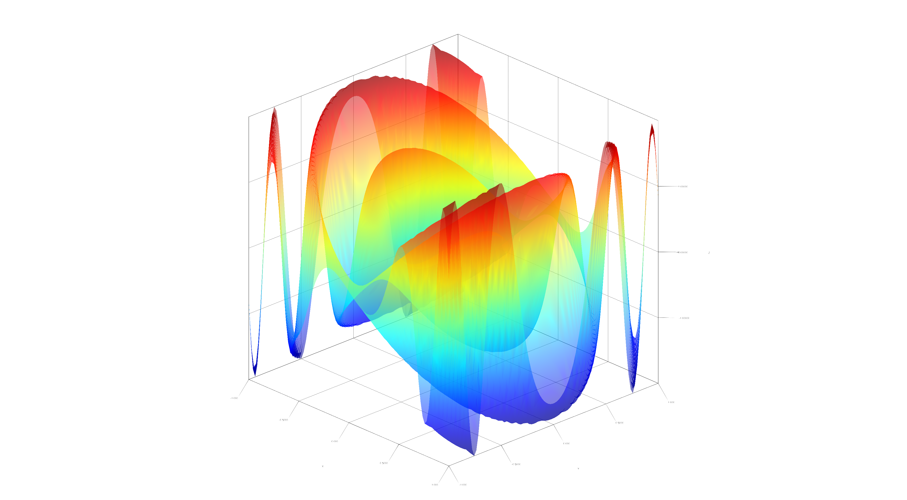
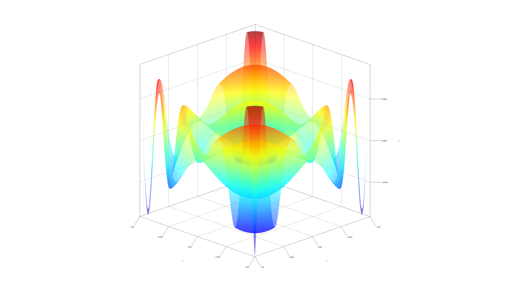
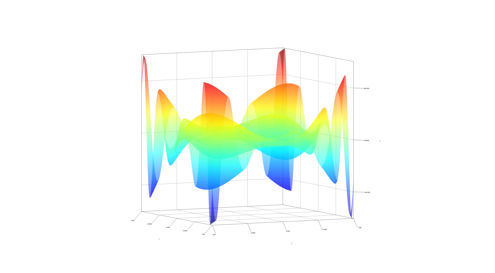

# Kotlin𝛁: Type-safe Automatic Differentiation for Kotlin

Kotlin𝛁 is a framework for type-safe [automatic differentiation](https://en.wikipedia.org/wiki/Automatic_differentiation) in [Kotlin](https://kotl.in). It allows users to express differentiable programs on higher-dimensional data structures and operators. We attempt to restrict syntactically valid constructions to those which are algebraically valid and can be checked at compile-time. By enforcing these constraints in the type system, it eliminates certain classes of runtime errors that may occur during the execution of a correctly-typed program. Due to type-inference in the language, most types may be safely omitted by the end user. Kotlin𝛁 strives to be expressive, safe, and notationally similar to mathematics. It is currently pre-release and offers no stability guarantees at this time.

## Introduction

Inspired by [Stalin∇](https://github.com/Functional-AutoDiff/STALINGRAD), [Autograd](https://github.com/hips/autograd), [DiffSharp](https://github.com/DiffSharp/DiffSharp), [Myia](https://github.com/mila-udem/myia), [Nexus](https://github.com/ctongfei/nexus), [Tangent](https://github.com/google/tangent), [Lantern](https://github.com/feiwang3311/Lantern) et al., Kotlin𝛁 attempts to port recent advancements in automatic differentiation (AD) to the Kotlin language. AD is useful for [gradient descent](https://en.wikipedia.org/wiki/Gradient_descent) and has a variety of applications in numerical optimization and machine learning. It also adds a number of novel ideas, including shape-safety, algebraic expression rewriting and numerical stability checking with property-based testing. We aim to provide an algebraically-grounded implementation of AD for shape-safe tensor operations. Tensors in Kotlin𝛁 are represented as [multidimensional arrays](https://en.wikipedia.org/wiki/Tensor#As_multidimensional_arrays).

## Features

Kotlin𝛁 currently supports the following features:

* Arithmetical operations on scalars, vectors and matrices
* Shape-safe vector and matrix algebra
* Partial and higher-order differentiation on scalars
* Property-based testing for numerical gradient checking
* Recovery of symbolic derivatives from AD

Additionally, it aims to support:

* PyTorch-style [define-by-run](https://pytorch.org/tutorials/beginner/blitz/autograd_tutorial.html) semantics
* N-dimensional tensors and [higher-order tensor operators](https://en.wikipedia.org/wiki/Tensor_contraction)
* Fully-general AD over control flow, variable reassignment
(via [delgation](https://kotlinlang.org/docs/reference/delegated-properties.html)), and imperative array programming, possibly using a typed IR such as [Myia](https://github.com/mila-udem/myia)

All of these features are implemented without access to bytecode or special compiler tricks - just using [higher-order functions and lambdas](https://kotlinlang.org/docs/reference/lambdas.html) as shown in [Lambda the Ultimate Backpropogator](http://www-bcl.cs.may.ie/~barak/papers/toplas-reverse.pdf), embedded DSLs a la [Lightweight Modular Staging](https://infoscience.epfl.ch/record/150347/files/gpce63-rompf.pdf), and [ordinary generics](https://kotlinlang.org/docs/reference/generics.html).

## Usage

### Notation

Kotlin𝛁 operators are [higher-order functions](https://en.wikipedia.org/wiki/Higher-order_function), which take at most two inputs and return a single output, all of which are functions with the same numerical type, and whose shape is denoted using superscript in the rightmost column below. 

|             Math<sup>&dagger;</sup>             |             Infix             |              Prefix              |     Postfix<sup>&Dagger;</sup>      |                                                    Type                                                    |
|:-----------------------------------------------:|:-----------------------------:|:--------------------------------:|:-----------------------------------:|:----------------------------------------------------------------------------------------------------------:|
|                  **A** + **B**                  |    `a + b`<br>`a.plus(b)`     |           `plus(a, b)`           |                                     |  (`a`:  ℝ<sup>τ</sup>→ℝ<sup>π</sup>, `b`: ℝ<sup>λ</sup> → ℝ<sup>π</sup>) → (ℝ<sup>?</sup>→ ℝ<sup>π</sup>)  |
|                  **A** - **B**                  |    `a - b`<br>`a.minus(b)`    |          `minus(a, b)`           |                                     |  (`a`:  ℝ<sup>τ</sup>→ℝ<sup>π</sup>, `b`: ℝ<sup>λ</sup> → ℝ<sup>π</sup>) → (ℝ<sup>?</sup>→ℝ<sup>π</sup>)   |
|                   **A** **B**                   |    `a * b`<br>`a.times(b)`    |          `times(a, b)`           |                                     | (`a`: ℝ<sup>τ</sup>→ℝ<sup>m×n</sup>, `b`: ℝ<sup>λ</sup>→ℝ<sup>n×p</sup>) → (ℝ<sup>?</sup>→ℝ<sup>m×p</sup>) |
| **A** / **B**<sup>&sect;</sup><br>**A** **B**⁻¹ |     `a / b`<br>`a.div(b)`     |           `div(a, b)`            |                                     | (`a`: ℝ<sup>τ</sup>→ℝ<sup>m×n</sup>, `b`: ℝ<sup>λ</sup>→ℝ<sup>p×n</sup>) → (ℝ<sup>?</sup>→ℝ<sup>m×p</sup>) |
|                -**A**<br>+**A**                 |                               |           `-a`<br>`+a`           | `a.unaryMinus()`<br>`a.unaryPlus()` |                     (`a`: ℝ<sup>τ</sup>→ℝ<sup>π</sup>) → (ℝ<sup>τ</sup>→ℝ<sup>π</sup>)                     |
|         **A** + **1**<br>**A** - **1**          |    `a + one`<br>`a - one`     |          `++a`<br>`--a`          | `a++`,`a.inc()`<br>`a--`,`a.dec()`  |                   (`a`: ℝ<sup>τ</sup>→ℝ<sup>m×m</sup>) → (ℝ<sup>τ</sup>→ℝ<sup>m×m</sup>)                   |
|        *sin*(a)<br>*cos*(a)<br>*tan*(a)         |                               | `sin(a)`<br>`cos(a)`<br>`tan(a)` | `a.sin()`<br>`a.cos()`<br>`a.tan()` |                                             (`a`: ℝ→ℝ) → (ℝ→ℝ)                                             |
|                   *ln*(**A**)                   |                               |       `ln(a)`<br>`log(a)`        |        `a.ln()`<br>`a.log()`        |                   (`a`: ℝ<sup>τ</sup>→ℝ<sup>m×m</sup>) → (ℝ<sup>τ</sup>→ℝ<sup>m×m</sup>)                   |
|            *log*<sub>b</sub>(**A**)             |          `a.log(b)`           |           `log(a, b)`            |                                     |        (`a`: ℝ<sup>τ</sup>→ℝ<sup>m×m</sup>, `b`: ℝ<sup>λ</sup>→ℝ<sup>m×m</sup>) → (ℝ<sup>?</sup>→ℝ)        |
|                **A**<sup>b</sup>                |          `a.pow(b)`           |           `pow(a, b)`            |                                     |        (`a`: ℝ<sup>τ</sup>→ℝ<sup>m×m</sup>, `b`: ℝ<sup>λ</sup>→ℝ) → (ℝ<sup>?</sup>→ℝ<sup>m×m</sup>)        |
|                    √a<br>∛a                     | `a.pow(1.0/2)`<br>`a.root(3)` |      `sqrt(a)`<br>`cbrt(a)`      |      `a.sqrt()`<br>`a.cbrt()`       |                         (`a`: ℝ<sup>τ</sup>→ℝ<sup>m×m</sup>) → (ℝ→ℝ<sup>m×m</sup>)                         |
|   <sup>da</sup>&frasl;<sub>db</sub><br>a'(b)    |          `a.diff(b)`          |           `grad(a)[b]`           |            `d(a) / d(b)`            |                     (`a`: C(ℝ<sup>m</sup>)<sup>*</sup>, `b`: ℝ→ℝ) → (ℝ<sup>m</sup>→ℝ)                      |
|                       ∇a                        |                               |            `grad(a)`             |             `a.grad()`              |                    (`a`: C(ℝ<sup>m</sup>)<sup>*</sup>) → (ℝ<sup>m</sup>→ℝ<sup>m</sup>)                     |

More concretely, ℝ can be a `Double`, `Float` or `BigDecimal`. Specialized operators defined for subsets of ℝ, e.g. `Int`, `Short` or `BigInteger` for subsets of ℤ, however differentiation is [only defined](https://en.wikipedia.org/wiki/Differentiable_function) for continuous functions on ℝ.

<sup>&dagger;</sup> `a` and `b` are higher-order functions. These may be constants (e.g. `0`, `1.0`), variables (e.g. `Var("x")`) or expressions (e.g. `x + 1`, `2 * x + y`).

<sup>&Dagger;</sup> For infix notation, `.` is optional. Parentheses are also optional depending on [precedence](https://kotlinlang.org/docs/reference/functions.html#infix-notation).

<sup>&sect;</sup> Matrix division is defined iff **B** is invertible, although it could be possible to redefine this operator using the [Moore-Penrose inverse](https://en.wikipedia.org/wiki/Moore%E2%80%93Penrose_inverse).

<sup>&lowast;</sup> Where C(ℝ<sup>m</sup>) is the space of all continuous functions 𝑓: ℝ<sup>m</sup>→ℝ. If the function is not over ℝ, it will fail at compile time. If the function is over ℝ but not continuous differentiable at the point under consideration, it will fail at runtime.

<sup>?</sup> While it would be nice to infer a combined input type for binary functions, it likely impossible using the Kotlin type system. Otherwise, if the user desires compile-time shape-safety when invoking higher order functions with literal values, they will need to specify the combined input type explicitly, or wait for a runtime exception.

<sup>τ, λ</sup> Arbitrarily shaped tensors.

### Shape Safety

Shape safety is an important concept in Kotlin𝛁. There are three broad strategies for handling shape errors:

* Hide the error somehow by implicitly reshaping or [broadcasting](https://docs.scipy.org/doc/numpy-1.10.4/user/basics.broadcasting.html) arrays
* Announce the error at runtime, with a relevant message, e.g. "[InvalidArgumentError](https://www.tensorflow.org/api_docs/python/tf/errors/InvalidArgumentError)"
* Do not allow programs which can result in a shape error to compile

In Kotlin𝛁, we use the last strategy to check the shape of tensor operations. Consider the following program:

```kotlin
// Inferred type: Vec<Int, `2`>
val a = Vec(1.0, 2.0)
// Inferred type: Vec<Int, `3`>
val b = Vec(1.0, 2.0, 3.0)

val c = b + b

// Does not compile, shape mismatch
// a + b
```

Attempting to sum two vectors whose shapes do not match will fail to compile, and they must be explicitly resized.

```kotlin
// Inferred type: Mat<Double, `1`, `4`>
val a = Mat(`1`, `4`, 1.0, 2.0, 3.0, 4.0)
// Inferred type: Mat<Double, `4`, `1`>
val b = Mat(`4`, `1`, 1.0, 2.0, 3.0, 4.0)

val c = a * b

// Does not compile, inner dimension mismatch
// a * a
// b * b
```

Similarly, attempting to multiply two tensors whose inner dimensions do not match will fail to compile.

```kotlin
val a = Mat(`2`, `4`, 
  1.0, 2.0, 3.0, 4.0,
  5.0, 6.0, 7.0, 8.0
)

val b = Mat(`4`, `2`, 
  1.0, 2.0,
  3.0, 4.0,
  5.0, 6.0,
  7.0, 8.0
)

// Types are optional, but encouraged
val c: Mat<Double, `2`, `2`> = a * b 

val d = Mat(`2`, `1`, 1.0, 2.0)

val e = c * d

val f = Mat(`3`, `1`, 1.0, 2.0, 3.0)

// Does not compile, inner dimension mismatch
// e * f
```

Explict types are optional but encouraged. [Type inference](https://www.youtube.com/watch?v=MyljSWm0Y_k) helps preserve shape information over long programs.

```kotlin
fun someMatFun(m: Mat<Double, `3`, `1`>): Mat<Double, `3`, `3`> = ...
fun someMatFun(m: Mat<Double, `2`, `2`>) = ...
```

When writing a function, it is mandatory to declare the input type(s), but the return type [may be omitted](https://kotlinlang.org/docs/reference/functions.html#explicit-return-types). Shape-safety is currently supported up to rank-2 tensors, i.e. matrices.

### Example

The following example shows how to derive higher-order partials of a function `z` of type ℝ²→ℝ:

```kotlin
import edu.umontreal.kotlingrad.numerical.DoublePrecision

@Suppress("NonAsciiCharacters", "LocalVariableName")
fun main() {
  with(DoublePrecision) { 
    val x = Var("x")
    val y = Var("y")

    val z = x * (-sin(x * y) + y) * 4  // Infix notation
    val `∂z∕∂x` = d(z) / d(x)          // Leibniz notation
    val `∂z∕∂y` = d(z) / d(y)          // Partial derivatives
    val `∂²z∕∂x²` = d(`∂z∕∂x`) / d(x)  // Higher order derivatives
    val `∂²z∕∂x∂y` = d(`∂z∕∂x`) / d(y) // Higher order partials
    val `∇z` = z.grad()                // Gradient operator

    val values = mapOf(x to 0, y to 1)
    val indVar = z.variables.joinToString(", ")

    print("z($indVar) \t\t\t= $z\n" +
        "z($values) \t\t\t= ${z(values)}\n" +
        "∂z($values)/∂x \t\t= $`∂z∕∂x` \n\t\t\t\t= " + `∂z∕∂x`(values) + "\n" +
        "∂z($values)/∂y \t\t= $`∂z∕∂y` \n\t\t\t\t= " + `∂z∕∂y`(values) + "\n" +
        "∂²z($values)/∂x² \t\t= $`∂z∕∂y` \n\t\t\t\t= " + `∂²z∕∂x²`(values) + "\n" +
        "∂²z($values)/∂x∂y \t\t= $`∂²z∕∂x∂y` \n\t\t\t\t= " + `∂²z∕∂x∂y`(values) + "\n" +
        "∇z($values) \t\t\t= $`∇z` \n\t\t\t\t= [${`∇z`[x]!!(values)}, ${`∇z`[y]!!(values)}]ᵀ")
  }
}
```

Any backticks and unicode characters above are simply for readability and have no effect on the behavior. Running [this program](src/main/kotlin/edu/umontreal/kotlingrad/samples/HelloKotlinGrad.kt) via `./gradlew demo` should print:

```kotlin
z(x, y) 			= ((x * (-sin((x * y)) + y)) * 4)
z({x=0, y=1}) 			= 0.0
∂z({x=0, y=1})/∂x 		= (((-sin((x * y)) + y) + (x * -(cos((x * y)) * y))) * 4) 
				= 4.0
∂z({x=0, y=1})/∂y 		= ((x * (-(cos((x * y)) * x) + 1)) * 4) 
				= 0.0
∂²z({x=0, y=1})/∂x² 		= ((x * (-(cos((x * y)) * x) + 1)) * 4) 
				= -8.0
∂²z({x=0, y=1})/∂x∂y 		= (((-(cos((x * y)) * x) + 1) + (x * -((-(sin((x * y)) * x) * y) + cos((x * y))))) * 4) 
				= 4.0
∇z({x=0, y=1}) 			= {x=(((-sin((x * y)) + y) + (x * -(cos((x * y)) * y))) * 4), y=((x * (-(cos((x * y)) * x) + 1)) * 4)} 
				= [4.0, 0.0]ᵀ
```

## Plotting


This plot was generated with the following code:

```kotlin
fun main(args: Array<String>) {
  with(DoublePrecision) {
    val x = Var("x")

    val y = sin(sin(sin(x))) / x + sin(x) * x + cos(x) + x
    val `dy∕dx` = d(y) / d(x)
    val `d²y∕dx²` = d(`dy∕dx`) / d(x)
    val `d³y∕dx³` = d(`d²y∕dx²`) / d(x)
    val `d⁴y∕dx⁴` = d(`d³y∕dx³`) / d(x)
    val `d⁵y∕dx⁵` = d(`d⁴y∕dx⁴`) / d(x)

    val xs = -10.0..10.0 step 0.09
    val ys = (xs.map { listOf(it, y(it), "y") }
            + xs.map { listOf(it, `dy∕dx`(it), "dy/dx") }
            + xs.map { listOf(it, `d²y∕dx²`(it), "d²y/x²") }
            + xs.map { listOf(it, `d³y∕dx³`(it), "d³y/dx³") }
            + xs.map { listOf(it, `d⁴y∕dx⁴`(it), "d⁴y/dx⁴") }
            + xs.map { listOf(it, `d⁵y∕dx⁵`(it), "d⁵y/dx⁵") }).flatten()

    dataFrameOf("x", "y", "Function")(ys)
      .plot(x = "x", y = "y", color = "Function")
      .geomLine(size = 1.0)
      .title("Derivatives of y=$y")
      .save(File("src/main/resources/plot.png"))
  }
}
```

To generate the above plot, you will need to install R and some packages. Ubuntu 18.04 instructions follow:

```sh
sudo apt-get install r-base && \
sudo ln -s /usr/bin/R /usr/local/bin/R && \
R -e "install.packages(c('ggplot2','dplyr','readr','forcats'))"
```

Then run `./gradlew plot`.

Plotting is also possible in higher dimensions, [for example](src/main/kotlin/edu/umontreal/kotlingrad/samples/Jzy3Demo.kt) in 3D via `./gradlew plot3D` (no other libraries requried):






## Testing

To run [the tests](src/test/kotlin/edu/umontreal/kotlingrad), execute: `./gradlew test`

Kotlin𝛁 claims to eliminate certain runtime errors, but how do we know the proposed implementation is not incorrect? One method, borrowed from the Haskell community, is called property-based testing (PBT), closely related to [metamorphic testing](https://en.wikipedia.org/wiki/Metamorphic_testing). Notable implementations include [QuickCheck](https://github.com/nick8325/quickcheck), [Hypothesis](https://github.com/HypothesisWorks/hypothesis) and [ScalaTest](http://www.scalatest.org/user_guide/property_based_testing) (ported to Kotlin in [KotlinTest](https://github.com/kotlintest/kotlintest)). PBT uses algebraic properties to verify the result of an operation by constructing semantically equivalent but syntactically distinct expressions, which should produce the same answer. Kotlin𝛁 uses two such equivalences to validate its AD implementation:

* [Symbolic differentiation](https://en.wikipedia.org/wiki/Differentiation_rules): manually differentiate and compare the values returned on a subset of the domain with AD.
* [Finite difference approximation](https://en.wikipedia.org/wiki/Finite_difference_method): sample space of symbolic (differentiable) functions, comparing results of AD to FD.

For example, consider the following test, which checks whether the manual derivative and the automatic derivative, when evaluated at a given point, are equal to each other within the limits of numerical precision:

```kotlin
val x = Var("x")
val y = Var("y")

val z = y * (sin(x * y) - x)            // Function under test
val `∂z∕∂x` = d(z) / d(x)               // Automatic derivative
val manualDx = y * (cos(x * y) * y - 1) // Manual derivative 

"∂z/∂x should be y * (cos(x * y) * y - 1)" {
  assertAll(NumericalGenerator, NumericalGenerator) { ẋ, ẏ ->
    // Evaluate the results at a given seed
    val autoEval = `∂z∕∂x`(x to ẋ, y to ẏ) 
    val manualEval = manualDx(x to ẋ, y to ẏ)
    // Should pass if Δ(adEval, manualEval) < Ɛ
    autoEval shouldBeApproximately manualEval
  }
}
```

PBT will search the input space for two numerical values `ẋ` and `ẏ`, which violate the specification, then ["shrink"](http://hackage.haskell.org/package/QuickCheck-2.12.6.1/docs/Test-QuickCheck-Arbitrary.html#v:shrink) them to discover pass-fail boundary values. We can construct a similar test using finite differences:

```kotlin
"d(sin x)/dx should be equal to (sin(x + dx) - sin(x)) / dx" {
  assertAll(NumericalGenerator) { ẋ ->
    val f = sin(x)
    
    val `df∕dx` = d(f) / d(x)
    val adEval = `df∕dx`(ẋ) 
    
    val dx = 1E-8
    // Since ẋ is a raw numeric type, sin => kotlin.math.sin
    val fdEval = (sin(ẋ + dx) - sin(ẋ)) / dx
    adEval shouldBeApproximately fdEval
  }
}
```

There are many other ways to independently verify the numerical gradient, such as [dual numbers](https://en.wikipedia.org/wiki/Dual_number#Differentiation) or the [complex step derivative](https://timvieira.github.io/blog/post/2014/08/07/complex-step-derivative/). Another method is to compare the numerical output against a well-known implementation, such as [TensorFlow](https://github.com/JetBrains/kotlin-native/tree/master/samples/tensorflow). We plan to conduct a more thorough comparison of numerical accuracy and performance.

## How?

This project relies on a few Kotlin-native language features, which together enable a concise, flexible and type-safe user interface. The following features have proven beneficial to the development of Kotlin𝛁:

#### Operator overloading
 
[Operator overloading](https://kotlinlang.org/docs/reference/operator-overloading.html) enables concise notation for arithmetic on abstract types, where the types encode [algebraic structures](https://en.wikipedia.org/wiki/Algebraic_structure), e.g. [`Group`](src/main/kotlin/edu/umontreal/kotlingrad/algebra/Group.kt), [`Ring`](src/main/kotlin/edu/umontreal/kotlingrad/algebra/Ring.kt), and [`Field`](src/main/kotlin/edu/umontreal/kotlingrad/algebra/Field.kt). These abstractions are extensible to other kinds of mathematical structures, such as complex numbers and quaternions.

For example, suppose we have an interface `Group`, which overloads the operators `+` and `*`, and is defined like so:

```kotlin
interface Group<T: Group<T>> {
  operator fun plus(addend: T): T

  operator fun times(multiplicand: T): T
}
```

Here, we specify a recursive type bound using a method known as [F-bounded quantification](http://staff.ustc.edu.cn/~xyfeng/teaching/FOPL/lectureNotes/CookFBound89.pdf) to ensure that operations return the concrete type variable `T`, rather than something more generic like `Group`. Imagine a class `Expr` which has implemented `Group`. It can be used as follows:

```kotlin
fun <T: Group<T>> cubed(t: T): T = t * t * t

fun <E: Expr<E>> twiceExprCubed(e: E): E = cubed(e) + cubed(e)
```

Like [Python](https://docs.python.org/3.4/library/operator.html), Kotlin supports overloading a [limited set of operators](https://kotlinlang.org/docs/reference/operator-overloading.html), which are evaluated using a [fixed precedence](https://kotlinlang.org/docs/reference/grammar.html#precedence). In the current version of Kotlin𝛁, operators do not perform any computation, they simply construct a directed acyclic graph representing the symbolic expression. Expressions are only evaluated when invoked as a function.

#### First-class functions

With [higher-order functions and lambdas](https://kotlinlang.org/docs/reference/lambdas.html), Kotlin treats [functions as first-class citizens](https://en.wikipedia.org/wiki/First-class_function). This allows us to represent mathematical functions and programming functions with the same underlying abstractions (typed FP). A number of [recent](http://www-bcl.cs.may.ie/~barak/papers/toplas-reverse.pdf) [papers](http://papers.nips.cc/paper/8221-backpropagation-with-callbacks-foundations-for-efficient-and-expressive-differentiable-programming.pdf) have demonstrated the expressiveness of this paradigm for automatic differentiation.

In Kotlin𝛁, all expressions can be treated as functions. For example:

```kotlin
fun <T: Group<T>> makePoly(x: Var<T>, y: Var<T>) = x * y + y * y + x * x

val x: Var<Double> = Var(1.0)
val f = makePoly(x, y)
val z = f(1.0, 2.0) // Returns a value
println(z) // Prints: 7
```

Currently, it is only possible to represent functions where all inputs and outputs share a single type. In future iterations, it is possible to extend support for building functions with varying input/output types and enforce constraints on both, using [covariant and contravariant](https://kotlinlang.org/docs/reference/generics.html) type bounds.

#### Coroutines

[Coroutines](https://kotlinlang.org/docs/reference/coroutines/basics.html) are a generalization of subroutines for non-preemptive multitasking, typically implemented using [continuations](https://en.wikipedia.org/wiki/Continuation). One form of continuation, known as shift-reset a.k.a. delimited continuations, are sufficient for implementing reverse mode AD with operator overloading alone (without any additional data structures) as described by Wang et al. in *[Shift/Reset the Penultimate Backpropagator](https://arxiv.org/pdf/1803.10228.pdf)* and later in *[Backpropagation with Continuation Callbacks](http://papers.nips.cc/paper/8221-backpropagation-with-callbacks-foundations-for-efficient-and-expressive-differentiable-programming.pdf)*. Delimited continuations [can be implemented](https://gist.github.com/elizarov/5bbbe5a3b88985ae577d8ec3706e85ef) using Kotlin coroutines and would be an interesting extension to this work. Please stay tuned!

#### Extension Functions

[Extension functions](https://kotlinlang.org/docs/reference/extensions.html) augment external classes with new fields and methods. Via [context oriented programming](https://proandroiddev.com/an-introduction-context-oriented-programming-in-kotlin-2e79d316b0a2), Kotlin𝛁 can expose its custom extensions (e.g. in [DoublePrecision](src/main/kotlin/edu/umontreal/kotlingrad/numerical/Precision.kt)) to [consumers](src/main/kotlin/edu/umontreal/kotlingrad/samples/HelloKotlinGrad.kt) without requiring subclasses or inheritance.

```kotlin
data class Const<T: Group<T>>(val number: Double) : Expr()
data class Sum<T: Group<T>>(val e1: Expr, val e2: Expr) : Expr()
data class Prod<T: Group<T>>(val e1: Expr, val e2: Expr) : Expr()

class Expr<T: Group<T>>: Group<Expr<T>> {
  operator fun plus(addend: Expr<T>) = Sum(this, addend)
  
  operator fun times(multiplicand: Expr<T>) = Prod(this, multiplicand)
}

object DoubleContext {
  operator fun Number.times(expr: Expr<Double>) = Const(toDouble()) * expr
}
```

Now, we can use the context to define another extension, `Expr.multiplyByTwo`, which computes the product inside a `DoubleContext`, using the operator overload we defined above:

```kotlin
fun Expr<Double>.multiplyByTwo() = with(DoubleContext) { 2 * this } // Uses `*` operator in DoubleContext
```

Extensions can also be defined in another file or context and imported on demand.

#### Algebraic data types (ADTs)

[Algebraic data types](https://en.wikipedia.org/wiki/Algebraic_data_type) in the form of [sealed classes](https://kotlinlang.org/docs/reference/sealed-classes.html) (a.k.a. sum types) allows creating a closed set of internal subclasses to guarantee an exhaustive control flow over the concrete types of an abstract class. At runtime, we can branch on the concrete type of the abstract class. For example, suppose we have the following classes:

```kotlin
sealed class Expr<T: Group<T>>: Group<Expr<T>> {
    fun diff() = when(expr) {
        is Const -> Zero
        // Smart casting allows us to access members of a checked typed without explicit casting
        is Sum -> e1.diff() + e2.diff()
        // Product rule: d(u*v)/dx = du/dx * v + u * dv/dx
        is Prod -> e1.diff() * e2 + e1 * e2.diff()
        is Var -> One
        // Since the subclasses of Expr are a closed set, the compiler does not require an `else -> ...`
    }
    
    operator fun plus(addend: Expr<T>) = Sum(this, addend)
      
    operator fun times(multiplicand: Expr<T>) = Prod(this, multiplicand)
}

data class Const<T: Group<T>>(val number: Double) : Expr()
data class Sum<T: Group<T>>(val e1: Expr, val e2: Expr) : Expr()
data class Prod<T: Group<T>>(val e1: Expr, val e2: Expr) : Expr()
class Var<T: Group<T>>: Expr()
class Zero<T: Group<T>>: Const<T>
class One<T: Group<T>>: Const<T>
```

Users are forced to handle all subclasses when branching on the type of a sealed class, as incomplete control flow will not compile (instead of say, failing silently at runtime).

[Smart-casting](https://kotlinlang.org/docs/reference/typecasts.html#smart-casts) allows us to treat the abstract type `Expr` as a concrete type, e.g. `Sum` after performing an `is Sum` check. Otherwise, we would need to write `(expr as Sum).e1` in order to access its field, `e1`. Performing a cast without checking would throw a runtime exception, if the type were incorrect. Using sealed classes helps avoid casting, thus avoiding `ClassCastException`s.

#### Multiple Dispatch

In conjunction with ADTs, Kotlin𝛁 also uses [multiple dispatch](https://en.wikipedia.org/wiki/Multiple_dispatch) to instantiate the most specific result type of [applying an operator](https://github.com/breandan/kotlingrad/blob/09f4aaf789238820fb5285706e0f1e22ade59b7c/src/main/kotlin/edu/umontreal/kotlingrad/functions/Function.kt#L24-L38) based on the type of its operands. While multiple dispatch is not an explicit language feature, it can be emulated using inheritance.

Building on the previous example, a common task in AD is to [simplify a graph](http://deeplearning.net/software/theano/extending/optimization.html). This is useful in order to minimize the number of calculations required, or to improve numerical stability. We can eagerly simplify expressions based on algebraic [rules of replacement](https://en.wikipedia.org/wiki/Rule_of_replacement). Smart casting allows us to access members of a class after checking its type, without explicitly casting it:

[//]: # (Note: numerical stability is sensitive to the order of rewriting, cf. https://en.wikipedia.org/wiki/Kahan_summation_algorithm)

```kotlin
override fun times(multiplicand: Function<X>): Function<X> = when {
  this == zero -> this
  this == one -> multiplicand
  multiplicand == one -> this
  multiplicand == zero -> multiplicand
  this == multiplicand -> pow(two)
  this is Const && multiplicand is Const -> const(value * multiplicand.value)
  // Further simplification is possible using rules of replacement
  else -> Prod(this, multiplicand)
}

val result = Const(2.0) * Sum(Var(2.0), Const(3.0)) // Sum(Prod(Const(2.0), Var(2.0)), Const(6.0))
```

This allows us to put all related control flow on a single abstract class which is inherited by subclasses, simplifying readability, debugging and refactoring.

#### Shape-safe Tensor Operations

While first-class [dependent types](https://wiki.haskell.org/Dependent_type) are useful for ensuring arbitrary shape safety (e.g. when concatenating and reshaping matrices), they are unnecessary for simple equality checking (such as when multiplying two matrices).* When the shape of a tensor is known at compile time, it is possible to encode this information using a less powerful type system, as long as it supports subtyping and parametric polymorphism (a.k.a. generics). In practice, we can implement a shape-checked tensor arithmetic in languages like Java, Kotlin, C++, C# or Typescript, which accept generic type parameters. In Kotlin, whose type system is [less expressive](https://kotlinlang.org/docs/reference/generics.html#variance) than Java, we use the following strategy.

First, we enumerate a list of integer type literals as a chain of subtypes, so that `0 <: 1 <: 2 <: 3 <: ... <: C`, where `C` is the largest fixed-length dimension we wish to represent. Using this encoding, we are guaranteed linear growth in space and time for subtype checking. `C` can be specified by the user, but they will need to rebuild this project from scratch.

```kotlin
open class `0`(override val i: Int = 0): `1`(i) { companion object: `0`(), Nat<`0`> }
open class `1`(override val i: Int = 1): `2`(i) { companion object: `1`(), Nat<`1`> }
open class `2`(override val i: Int = 2): `3`(i) { companion object: `2`(), Nat<`2`> }
open class `3`(override val i: Int = 3): `4`(i) { companion object: `3`(), Nat<`3`> }
//...This is generated
sealed class `100`(open val i: Int = 100) { companion object: `100`(), Nat<`100`> }
interface Nat<T: `100`> { val i: Int } // Used for certain type bounds
```

Kotlin𝛁 supports shape-safe tensor operations by encoding tensor rank as a parameter of the operand’s type signature. Since integer literals are a chain of subtypes, we need only define tensor operations once using the highest literal, and can rely on Liskov substitution to preserve shape safety for all subtypes. For instance, consider the rank-1 tensor (i.e. vector) case:

```kotlin
@JvmName("floatVecPlus") infix operator fun <C: `100`, V: Vec<Float, C>> V.plus(v: V): Vec<Float, C> = Vec(length, contents.zip(v.contents).map { it.first + it.second })
```

This technique can be easily extended to additional infix operators. We can also define a shape-safe vector initializer by overloading the invoke operator on a companion object like so:

```kotlin
open class Vec<E, MaxLength: `100`> constructor(val length: Nat<MaxLength>, val contents: List<E> = listOf()) {
  operator fun get(i: `100`): E = contents[i.i]
  operator fun get(i: Int): E = contents[i]

  companion object {
    operator fun <T> invoke(t: T): Vec<T, `1`> = Vec(`1`, arrayListOf(t))
    operator fun <T> invoke(t0: T, t1: T): Vec<T, `2`> = Vec(`2`, arrayListOf(t0, t1))
    operator fun <T> invoke(t0: T, t1: T, t2: T): Vec<T, `3`> = Vec(`3`, arrayListOf(t0, t1, t2))
    //...
  }
}
```

The initializer may be omitted in favor of dynamic construction, although this may fail at runtime. For example:

```kotlin
val one = Vec(`3`, 1, 2, 3) + Vec(`3`, 1, 2, 3)   // Always runs safely
val add = Vec(`3`, 1, 2, 3) + Vec(`3`, listOf(t)) // May fail at runtime
val vec = Vec(`2`, 1, 2, 3)                       // Does not compile
val sum = Vec(`2`, 1, 2) + add                    // Does not compile
```

A similar syntax is possible for [matrices](src/main/kotlin/edu/umontreal/kotlingrad/dependent/MatExt.kt) and higher-rank tensors. For example, Kotlin𝛁 can infer the shape of multiplying two matrices, and will not compile if their inner dimensions do not match:

```kotlin
 // Inferred type: Mat<Int, `4`, `4`>
  val l = Mat(`4`, `4`,
    1, 2, 3, 4,
    5, 6, 7, 8,
    9, 0, 0, 0,
    9, 0, 0, 0
  )

  // Inferred type: Mat<Int, `4`, `3`>
  val m = Mat(`4`, `3`,
    1, 1, 1,
    2, 2, 2,
    3, 3, 3,
    4, 4, 4
  )

  // Inferred type: Mat<Int, `4`, `3`>
  val lm = l * m
  // m * m // Does not compile
```

[Further examples](src/main/kotlin/edu/umontreal/kotlingrad/dependent/MatDemo.kt) are provided for shape-safe matrix operations such as addition, subtraction and transposition.

A similar technique is possible in Haskell, which is capable of a more powerful form of type-level computation, [type arithmetic](https://wiki.haskell.org/Type_arithmetic). Type arithmetic makes it easy to express [convolutional arithmetic](https://arxiv.org/pdf/1603.07285.pdf) and other arithmetic operations on shape variables (say, splitting a vector in half), which is currently not possible, or would require enumerating every possible combination of type literals.

&lowast; Many less powerful type systems are still capable of performing arbitrary computation in the type checker. As specified, Java's type system is [known to be Turing Complete](https://arxiv.org/pdf/1605.05274.pdf). It may be possible to emulate a limited form of dependent types in Java by exploiting this property, although this may not computationally tractable due to the practical limitations noted by Grigore.

## Ideal API (WIP)

The current API is experimental, but can be improved in many ways. Currently variables are instantiated with default values, so when a function is invoked with missing values(s) (i.e. `z = x * y; z(x to 1) // y = ?`) the default value is applied. This is similar to [NumPy broadcasting](https://docs.scipy.org/doc/numpy-1.15.0/user/basics.broadcasting.html). However, we could encode the dimensionality of the function into the type. Instead of allowing default values, this would enforce passing mandatory values when invoking a function (similar to the [builder pattern](https://gist.github.com/breandan/d0d7c21bb7f78ef54c21ce6a6ac49b68)). 

When the shape of an N-dimensional array is known at compile-time, we can use type-level [integer literals](src/main/kotlin/edu/umontreal/kotlingrad/dependent) to ensure shape conforming tensor operations (inspired by [Nexus](https://github.com/ctongfei/nexus) and others).

Another optimization is to encode some useful properties of matrices into a variable's type, (e.g. `Singular`, `Symmetric`, `Orthogonal`, `Unitary`, `Hermitian`). Although it would be difficult to infer such properties using the JVM type system, if the user specified them explicitly, we could perform a number of specialized optimizations on such matrices.

### Scalar functions

A function's type would ideally encode arity, based on the number of unique variables:

```kotlin
val x = Var(1.0)                                // x: Variable<Double> inferred type
val y = Var(1.0)                                // x: Variable<Double> "
val f = x * y + sin(2 * x + 3 * y)              // f: BinaryFunction<Double> "
val g = f(x to -1.0)                            // g: UnaryFunction<Double> == -y + sin(-2 + 3 * y)
val h = f(x to 0.0, y to 0.0)                   // h: Const<Double> == 0 + sin(0 + 0) == 0
```

However inferring arity for arbitrary expressions at compile time would be difficult in the Kotlin type system. Instead, we can have the user specify it directly.

```kotlin
val x = Var(1.0)                                // x: Variable<Double> inferred type
val y = Var(1.0)                                // x: Variable<Double> "
val f = Fun(`2`) { x * y + sin(2 * x + 3 * y) } // f: BinaryFunction<Double> "
val g = f(x to -1.0)                            // g: UnaryFunction<Double> == -y + sin(-2 + 3 * y)
val h = f(x to 0.0, y to 0.0)                   // h: Const<Double> == 0 + sin(0 + 0) == 0
```

### Vector functions

Vector functions should have a size type, to ensure all values are set:

```kotlin
val x = VVar(0.0, 0.0, 0.0) // x: VVariable<Double, `3`>
val y = VVar(0.0, `3`)      // x: VVariable<Double, `3`>
val f = 2 * x + x / 2       // f: UnaryVFunction<Double>
val g = f(-2.0, 0.0, 2.0)   // g: ConstVector<`3`> == [-3. 0. 5.]
```

### Matrix functions

Multiplying matrices `x = N x M` and `y = M x P` should yield matrix `z` of type `N x P`:

```kotlin
val x = VVar(0.0, `3`, `1`) // y: MVariable<Double, `3`, `1`>
val y = VVar(0.0, 0.0)      // x: MVariable<Double, `1`, `2`>
val z = x * y               // z: MVariable<Double, `3`, `2`>
```

## Comparison

|                              Framework                               | Language |         AD         | FP<sup>&dagger;</sup> | TS<sup>&Dagger;</sup> |   SS<sup>*</sup>   | DP<sup>&sect;</sup> | MP<sup>&para;</sup> |
|:--------------------------------------------------------------------:|:--------:|:------------------:|:---------------------:|:---------------------:|:------------------:|:-------------------:|:-------------------:|
|                               Kotlin𝛁                               |  Kotlin  | :heavy_check_mark: |  :heavy_check_mark:   |  :heavy_check_mark:   | :heavy_check_mark: |   :construction:    |   :construction:    |
|          [DiffSharp](http://diffsharp.github.io/DiffSharp/)          |    F#    | :heavy_check_mark: |  :heavy_check_mark:   |  :heavy_check_mark:   |        :x:         | :heavy_check_mark:  |         :x:         |
| [TensorFlow.FSharp](https://github.com/fsprojects/TensorFlow.FSharp) |    F#    | :heavy_check_mark: |  :heavy_check_mark:   |  :heavy_check_mark:   | :heavy_check_mark: | :heavy_check_mark:  |         :x:         |
|              [Myia](https://github.com/mila-udem/myia)               |  Python  | :heavy_check_mark: |  :heavy_check_mark:   |  :heavy_check_mark:   | :heavy_check_mark: | :heavy_check_mark:  |         :x:         |
|   [Deeplearning.scala](https://deeplearning.thoughtworks.school/)    |  Scala   | :heavy_check_mark: |  :heavy_check_mark:   |  :heavy_check_mark:   |        :x:         | :heavy_check_mark:  |         :x:         |
|                  [Nexus](http://tongfei.me/nexus/)                   |  Scala   | :heavy_check_mark: |  :heavy_check_mark:   |  :heavy_check_mark:   | :heavy_check_mark: | :heavy_check_mark:  |         :x:         |
|          [Lantern](https://feiwang3311.github.io/Lantern/)           |  Scala   | :heavy_check_mark: |  :heavy_check_mark:   |  :heavy_check_mark:   |        :x:         | :heavy_check_mark:  |         :x:         |
|          [Grenade](https://github.com/HuwCampbell/grenade)           | Haskell  | :heavy_check_mark: |  :heavy_check_mark:   |  :heavy_check_mark:   | :heavy_check_mark: |         :x:         |         :x:         |
|             [Eclipse DL4J](https://deeplearning4j.org/)              |   Java   | :heavy_check_mark: |          :x:          |  :heavy_check_mark:   |        :x:         |         :x:         |         :x:         |
|                  [Halide](http://halide-lang.org/)                   |   C++    | :heavy_check_mark: |          :x:          |  :heavy_check_mark:   |        :x:         | :heavy_check_mark:  |         :x:         |
|     [Stalin∇](https://github.com/Functional-AutoDiff/STALINGRAD)     |  Scheme  | :heavy_check_mark: |  :heavy_check_mark:   |          :x:          |        :x:         |         :x:         |         :x:         |
|            [Autograd](https://github.com/HIPS/autograd/)             |  Python  | :heavy_check_mark: |          :x:          |          :x:          |        :x:         |         :x:         |         :x:         |
|             [Tangent](https://github.com/google/tangent)             |  Python  | :heavy_check_mark: |          :x:          |          :x:          |        :x:         |         :x:         |         :x:         |


<sup>&dagger;</sup> Functional programming

<sup>&Dagger;</sup> Type safe

<sup>&sect;</sup> Differentiable programming

<sup>&para;</sup> [Multiplatform](https://kotlinlang.org/docs/reference/multiplatform.html)

<sup>*</sup> Shape safe (compile-time)

## References

To the author's knowledge, Kotlin𝛁 is the first AD implementation in native Kotlin. While the particular synthesis of these ideas (i.e. shape-safe, functional AD, using generic types) is unique, it has been influenced by a long list of prior work in AD. Below is a list of projects and publications that helped inspire this work.

### Automatic Differentiation

* [The Simple Essence of Automatic Differentiation](http://conal.net/papers/essence-of-ad/essence-of-ad-icfp.pdf)
* [Reverse-Mode AD in a Functional Framework: Lambda the Ultimate Backpropagator](http://www-bcl.cs.may.ie/~barak/papers/toplas-reverse.pdf)
* [First-Class Automatic Differentiation in Swift: A Manifesto](https://gist.github.com/rxwei/30ba75ce092ab3b0dce4bde1fc2c9f1d)
* [AD and the danger of confusing infinitesimals](http://conway.rutgers.edu/~ccshan/wiki/blog/posts/Differentiation/)
* [Automatic differentiation in PyTorch](https://openreview.net/pdf?id=BJJsrmfCZ)
* [Automatic differentiation in machine learning: a survey](http://jmlr.org/papers/volume18/17-468/17-468.pdf)

### Differentiable Programming

* [Neural Networks, Types, and Functional Programming](http://colah.github.io/posts/2015-09-NN-Types-FP/)
* [Backpropagation with Continuation Callbacks: Foundations for Efficient and Expressive Differentiable Programming](http://papers.nips.cc/paper/8221-backpropagation-with-callbacks-foundations-for-efficient-and-expressive-differentiable-programming.pdf)
* [Backprop as Functor: A compositional perspective on supervised learning](https://arxiv.org/pdf/1711.10455.pdf)
* [Demystifying Differentiable Programming: Shift/Reset the Penultimate Backpropagator](https://www.cs.purdue.edu/homes/rompf/papers/wang-preprint201811.pdf)
* [Efficient Differentiable Programming in a Functional Array-Processing Language](https://arxiv.org/pdf/1806.02136.pdf)
* [Operational Calculus for Differentiable Programming](https://arxiv.org/pdf/1610.07690.pdf)
* [Differentiable Functional Programming](http://www.robots.ox.ac.uk/~gunes/assets/pdf/baydin-2016-slides-functionallondoners.pdf)
* [Differentiable Programming for Image Processing and Deep Learning in Halide](https://people.csail.mit.edu/tzumao/gradient_halide/gradient_halide.pdf)
* [Software 2.0](https://medium.com/@karpathy/software-2-0-a64152b37c35)

### Calculus

* [The Matrix Calculus You Need For Deep Learning](https://explained.ai/matrix-calculus/index.html)

### Computer Algebra

* [A Design Proposal for an Object Oriented Algebraic Library](https://pdfs.semanticscholar.org/6fd2/88960ef83469c898a3d8ed8f0950e7839625.pdf)
* [On Using Generics for Implementing Algebraic Structures](http://www.cs.ubbcluj.ro/~studia-i/contents/2011-4/02-Niculescu.pdf)
* [How to turn a scripting language into a domain specific language for computer algebra](https://arxiv.org/pdf/0811.1061.pdf)
* [Evaluation of a Java Computer Algebra System](https://pdfs.semanticscholar.org/ce81/39a9008bdc7d23be0ff05ef5a16d512b352c.pdf)
* [jalgebra](https://github.com/mdgeorge4153/jalgebra): An abstract algebra library for Java
* [Typesafe Abstractions for Tensor Operations](https://arxiv.org/pdf/1710.06892.pdf)
* [Generalized Algebraic Data Types and Object-Oriented Programming](https://www.microsoft.com/en-us/research/wp-content/uploads/2016/02/gadtoop.pdf)

### Computational Mathematics

* [KMath](https://github.com/altavir/kmath) - Kotlin mathematics extensions library
* [An introduction to context-oriented programming in Kotlin](https://proandroiddev.com/an-introduction-context-oriented-programming-in-kotlin-2e79d316b0a2)
* [COJAC](https://github.com/Cojac/Cojac) - Numerical sniffing tool and Enriching number wrapper for Java
* [chebfun](http://www.chebfun.org/) - Allows representing functions as [Chebyshev polynomials](https://en.wikipedia.org/wiki/Chebyshev_polynomials), for easy symbolic differentiation (or integration)

### Neural Networks

* [Hacker's Guide to Neural Networks](http://karpathy.github.io/neuralnets/)
* [Tricks from Deep Learning](https://arxiv.org/pdf/1611.03777.pdf)
* [Practical Dependent Types in Haskell: Type-Safe Neural Networks](https://blog.jle.im/entry/practical-dependent-types-in-haskell-1.html)
* [A guide to convolutional arithmetic for deep learning](https://arxiv.org/pdf/1603.07285.pdf)

### Type Systems

* [Dimension Types](https://link.springer.com/content/pdf/10.1007%2F3-540-57880-3_23.pdf)
* [An algebraic view of dimension types](https://www.cl.cam.ac.uk/techreports/UCAM-CL-TR-391.pdf#page=145)

### Automated Testing

* [DeepTest: Automated Testing of Deep-Neural-Network-driven Autonomous Cars](https://arxiv.org/pdf/1708.08559.pdf)
* [QuickCheck: A Lightweight Tool for Random Testing of Haskell Programs](https://www.eecs.northwestern.edu/~robby/courses/395-495-2009-fall/quick.pdf)

### Libraries

* [TensorFlow.FSharp](https://github.com/fsprojects/TensorFlow.FSharp): An TensorFlow DSL in F# for writing numeric models with support for interactive tensor shape-checking
* [Stalin∇](https://github.com/Functional-AutoDiff/STALINGRAD), a brutally optimizing compiler for the VLAD language, a pure dialect of Scheme with first-class automatic differentiation operators
* [Autograd](https://github.com/hips/autograd) - Efficiently computes derivatives of NumPy code
* [DiffSharp](https://github.com/DiffSharp/DiffSharp), a functional AD library implemented in the F# language
* [Myia](https://github.com/mila-udem/myia) - SCT based AD, adapted from Pearlmutter & Siskind's "Reverse Mode AD in a functional framework"
* [Nexus](https://github.com/ctongfei/nexus) - Type-safe tensors, deep learning and probabilistic programming in Scala
* [Tangent](https://github.com/google/tangent) - "Source-to-Source Debuggable Derivatives in Pure Python"
* [Grenade](https://github.com/HuwCampbell/grenade) - composable, dependently typed, practical, and fast RNNs in Haskell
* [Lantern](https://feiwang3311.github.io/Lantern/) - a framework in Scala, based on delimited continuations and multi-stage programming

## Special Thanks

The following individuals have helped shape this project through their enthusiasm and thoughtful feedback. Please check out their work.

* [Liam Paull](http://liampaull.ca)
* [Michalis Famelis](https://michalis.famelis.info/)
* [Hanneli Tavante](http://hannelita.com/)
* [Alexander Nozik](https://scholar.google.com/citations?user=B-WJi4kAAAAJ)
* [Maxime Chevalier-Boisvert](https://pointersgonewild.com/)